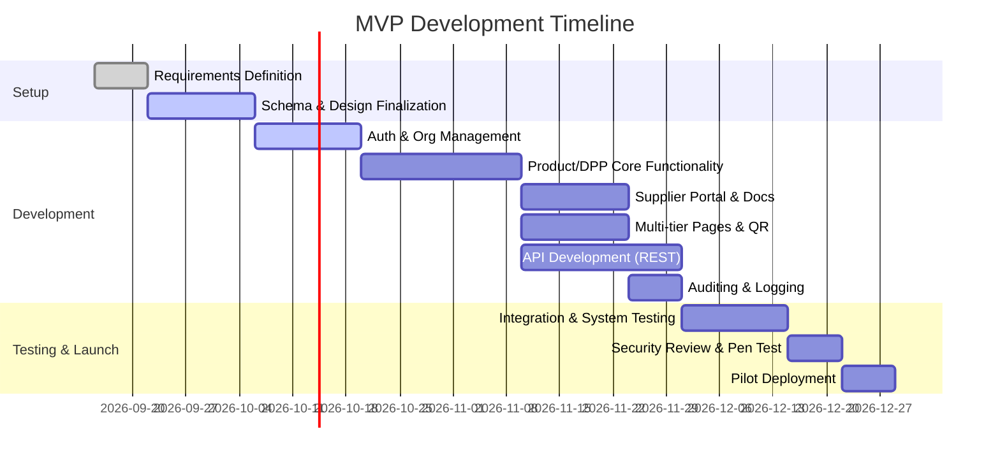

# Executive Summary  
The EU’s imminent DPP mandates make batteries the prime initial industry: the EU Battery Regulation (2023/1542) requires digital battery passports for EV, light transport, and industrial batteries from Feb 18, 2027. Other industries like textiles follow later (DPP delegated act due Q3–Q4 2027). We surveyed leading DPP platforms (Minespider, Circularise, Kezzler, dpp.cloud, WIARA’s DigitalProductPassport, Avery’s ReadyDPP, etc.) to identify features, tech stacks, and pricing (Table 1). All support DPPs and GS1 Digital Link identifiers, with most offering supplier portals, APIs, and some form of AI or data ingestion. Prices range from enterprise quotes (Minespider/Avery) to transparent tiered models (dpp.cloud).  

For batteries, we map the delegated-act fields (e.g. Annex VI/VIII A of the Battery Regulation) into a data schema (Table 2). Key fields include product ID (GS1 GTIN/serial), battery category, manufacturer, weight, capacity, chemistry, voltage, power, cycle-life, etc. Each field’s type, visibility (public for consumer-facing info vs. restricted for technical/regulatory data), and mandatory status are listed, based on the EU Guidance and Annex references.  

We propose an MVP scope with **must/should/can** features (Table 3), estimating ~80–100 person-days for core functionality. Must-have features include multi-tenant auth/roles, product/DPP creation forms, QR code generation, multilingual DPP pages with public/professional/authority access, data audit trails, and API endpoints. Should-have features are supplier data requests, document uploads, bulk import/export, and basic analytics. Optional (“can”) features include AI-assisted data extraction, blockchain audit trails, and rich consumer engagement modules. Each feature is prioritized and mapped to development effort, and a Mermaid Gantt chart (Figure 1) outlines a ~3–4 month roadmap (Sep–Dec 2026) for development, testing, and a pilot launch.  

For infrastructure, we estimate costs using AWS (Mumbai) and allied services. An MVP (single small VPS, managed PostgreSQL, minimal S3/CDN/monitoring) runs ~₹4–5K/month (₹50–60K/yr) under low load. A scaled production setup (multi-instance, larger DB, ~0.5TB storage, CDN, logging, AI APIs) could be ~₹30–35K/month (~₹0.36–0.42M/yr), depending on traffic and DPP volume. Assumptions: ~1–5 clients, ~10–50K pageviews/month, ~5K documents, few GPT-4 API calls. Cost breakdown is in Table 4.  

Compliance will require standard certifications and controls: ISO 27001 (Minespider already holds it), GDPR/data-protection compliance, regular penetration testing, secure TLS, etc. The platform must integrate with the EU DPP Registry (live July 2026) using qualified electronic seals (per eIDAS) for signing passports. A forthcoming “DPP service provider” delegated act (expected Q3 2027) may impose further accreditation.  

Our recommended tech stack leverages TypeScript throughout: **Angular** for a rich client UI, **NestJS (Node.js)** for the API/backend, and **PostgreSQL** for relational data. Static assets and documents use **AWS S3**, authentication uses JWT/OAuth2 with RBAC, and DPP pages can be hosted via **NGINX/Cloudflare CDN** for fast global access. We use JSON-LD/GS1 Digital Link for product identifiers. CI/CD pipelines (GitHub Actions) automate tests and deployments, and AI needs can be met via commercial LLM APIs (Azure OpenAI or Google) for OCR/data extraction. This stack is proven, scalable, and aligns with EU standards (JSON-LD, REST APIs, GS1).  

**Next Steps:** Finalize target (battery) and gather sample battery data; lock in EU regulatory references (e.g. delegated acts by Feb 2027) to finalize schema; refine MVP requirements with stakeholders; begin UX prototyping of DPP forms/pages; set up hosting/CI; register for a qualified certificate to test the EU DPP Registry; and line up a pilot client (e.g. an EV battery OEM or recycler). Key decision points include confirming the initial product scope (battery models/categories), pricing model (subscription vs per-SKU), and go-to-market partners (e.g. GS1, industry consortia). 

## 1. Competitor Platforms (Feature Comparison)  
We analyzed Minespider, Circularise, Kezzler, and other leading DPP solutions. All support EU DPP requirements (and often additional regulations) but differ in focus and delivery. A high-level comparison is in **Table 1**. Key observations:  

- **Minespider** targets heavy industries (mining, metals, batteries). It provides secure DPP and battery passports with AI-driven data extraction and a full audit trail. Minespider emphasizes blockchain-based provenance (open DLT protocol), a supplier portal, branded DPP pages, and standard APIs. It is ISO-27001 certified. Pricing is enterprise-custom.  
- **Circularise** targets supply-chain-intensive sectors (automotive, batteries, chemicals). Its platform has three modules: *Collect* (multi-tier supplier data collection with AI validation), *Trace* (auditable chain-of-custody/mass-balance), and *Share* (publishing DPPs via QR code). It offers an intuitive supplier portal (AI-enhanced data requests, OCR, automatic nudges) and permissioned data sharing. Circularise is DLT-based and GDPR-compliant. Pricing is not public (enterprise model).  
- **Kezzler** serves global brands (CPG, apparel, industrial). Its cloud platform connects product data through serialization and 2D codes. Kezzler includes modules for *Traceability*, *Compliance*, and *Consumer Engagement*. It explicitly supports DPP and Digital Battery Passport compliance. Kezzler provides APIs and integrations, and positions itself as a single platform for both regulatory data and marketing engagement (QR code campaigns). Pricing is case-by-case (enterprise).  
- **dpp.cloud (GetProdPass)** is an EU-focused startup for manufacturers. It offers a SaaS DPP builder with per-SKU activation fees. It pulls data from existing ERP/PIM systems (no heavy custom dev). It emphasizes quick setup (w/ pre-built templates) and volume scaling (100k+ products). It does *not* have a supplier portal or chain-of-custody module; it’s purely a DPP generator. Pricing is transparent: setup fee + annual fee + one-time per-SKU cost (e.g. €10–17K first year for platform + €0.25–€1 per SKU).  
- **DigitalProductPassport (WIARA)** is a Bulgarian SaaS solution, heavy on standards compliance. It generates multi-language DPP pages (24 EU languages) from a single entry form. It implements GS1 Digital Link IDs and JSON-LD (aligned to CEN-CENELEC DPP standards). It offers REST APIs for integration. A free plan covers 3 passports; paid plans add users and features (published pricing). All passports support the ESPR’s 3-tier access levels (public/professional/authority). This platform is lightweight (no blockchain, no supplier portal, no AI) but fully compliant.  
- **Avery Dennison ReadyDPP** (Optica) is an enterprise “full-stack” solution for apparel and industrial clients. It includes physical labels (QR/RFID tags), the atma.io cloud for DPP hosting, factory hardware for digital ID printing, and consulting/support. ReadyDPP markets itself on integration (one vendor for labels + digital platform) and security (Avery’s history with variable data). ABI Research cites Avery as a top DPP provider. No public pricing; it’s sold as a service with implementation.  

**Table 1.** *Feature comparison of DPP platform providers.* “Yes”/“No” indicates support or inclusion of feature.   

| Provider / Focus                | Target Customers      | DPP Support    | Supplier Portal   | Document Mgmt  | Chain-of-Custody* | AI/Smart Features                | API         | Blockchain    | Pricing Model (2026)              |
|---------------------------------|-----------------------|----------------|-------------------|----------------|-------------------|----------------------------------|-------------|---------------|-----------------------------------|
| **Minespider** (Germany)        | Miners, OEMs, EVs     | Yes (DPP/DBP)  | Yes (due diligence)| Yes (PDF, images) | Yes (end-to-end via DLT) | AI data extraction/cognitive input | Yes (REST API) | Yes (open blockchain) | Enterprise (quote)            |
| **Circularise** (Netherlands)   | Automotive, batteries, chemicals, textiles | Yes (DPP, Battery) | Yes (n-tier requests) | Yes (evidence upload)  | Yes (Mass-balance, custody) | AI supplier validation (OCR, consistency) | Yes (integrations) | Yes (private DLT) | Enterprise (contact)       |
| **Kezzler** (Norway/US)         | Global brands (FMCG, apparel, equipment) | Yes (DPP/DBP) | No (focus on ERP data) | Yes (asset history) | Yes (trace shipments) | QR-based engagement, analytics | Yes (cloud API) | No             | Enterprise (quote)            |
| **dpp.cloud** (Germany)         | Manufacturers/Brands  | Yes (DPP)      | No                | No             | No                | PIM/ERP sync, auto-QR           | Yes (ERP connectors) | No         | Tiered (setup + per-SKU) |
| **DigitalProductPassport** (WIARA, BG) | Any EU manufacturer | Yes (DPP only) | No                | No             | No                | Automatic 24-lang pages, audit logs | Yes (API-first) | No             | Freemium (free tier, pricing plans) |
| **Avery ReadyDPP** (US)         | Apparel/OEM brands    | Yes (DPP)      | Limited (labeling)| Yes (via Atma.io) | No                | OCR labels, geo-localization | Yes (atma.io API) | No          | Service (engagement)       |

> *Chain-of-custody refers to tracking supply-chain transformations (mass-balance) and ownership history.  

Citations: Minespider’s site highlights “AI copilot” extraction and API integration; Circularise’s site outlines Collect/Trace/Share modules; Kezzler emphasizes DPP and Battery Passport compliance. dpp.cloud publishes transparent pricing, and WIARA’s DigitalProductPassport clearly states multi-language support and standards (GS1, JSON-LD). Avery advertises its #1 DPP platform status and integrated label-to-cloud solution.  

## 2. Industry Focus: **Batteries**  
We recommend targeting **batteries** as the initial industry. The EU Ecodesign Regulation (ESPR) explicitly makes batteries the *first* DPP category, with passports mandatory for EV, light-transport, and industrial batteries from 18 Feb 2027. The Commission notes “Batteries are the first product group for which a DPP will become mandatory”. In contrast, textiles and other sectors come later (textiles DPP rules are adopted in 2027 for enforcement afterward). By focusing on batteries, we align with the most immediate regulatory deadline and a well-defined initial data set (the Battery Regulation and its guidance outline 71 data points). Market-wise, EV/battery manufacturers are already mobilizing (e.g. Ford, Honda pilots), so a ready DPP solution can capture early pilots and mandates.  

## 3. Battery DPP Data Schema (Delegated Act Fields)  
Under Reg. (EU) 2023/1542 (Battery Reg.), a Digital Battery Passport must include specific data elements for each battery (see Annexes VI–XIII). We map the key fields into a schema (Table 2), indicating type, visibility, and mandate. Visibility is tiered per ESPR: **Public** (consumer-facing), **Professional** (technicians/importers), **Authority** (market surveillance, requires eIDAS authentication). Most physical and composition fields are public or professional; legal documents are authority-only. Mandatory fields are from the Delegated Acts (Annex VI A and XIII) and the Commission guidance. GS1 identifiers and carriers are used (e.g. GTIN/serial in GS1 Digital Link format). Chain-of-custody event data (if captured) would align with GS1 EPCIS events. 

**Table 2.** *Battery DPP schema (sample fields).* (Types: string/text, number, date, etc.)  

| Field                          | Type        | Visibility        | Req.       | Source (Regulatory)                                |
|--------------------------------|-------------|-------------------|------------|----------------------------------------------------|
| Product Identifier (GS1 Digital Link URI) | String      | Public           | Mandatory | Unique ID (GTIN/Serial) – GS1 standard |
| Battery Category (EV/LMT/Industrial)     | Enum/String | Public           | Mandatory | BR Annex VI A (1)(2)               |
| Manufacturer (name & plant location)     | String      | Authority        | Mandatory | BR Annex VI A (3)                 |
| Manufacture Date (Month/Year)            | Date        | Authority        | Mandatory | BR Annex VI A (4)                 |
| Mass (kg)                        | Number      | Public           | Mandatory | BR Annex VI A (5)                 |
| Rated Energy Capacity (Wh)      | Number      | Public           | Mandatory | BR Annex VI A (6)                 |
| Battery Chemistry (e.g. NMC, LFP) | String    | Public           | Mandatory | BR Annex VI A (7)                 |
| Hazardous Substance Symbol (Cd/Pb) | String    | Public           | Mandatory | BR Annex VI A (9)                 |
| Nominal Voltage (V)             | Number      | Professional     | Mandatory | BR Annex XIII 1(h)                |
| Max Voltage (V)                 | Number      | Professional     | Mandatory | BR Annex XIII 1(h)                |
| Original Power (W)              | Number      | Professional     | Mandatory | BR Annex XIII 1(i)                |
| Cycle Life (cycles, tested)     | Number      | Professional     | Optional\*| BR Annex XIII 1(j) – for industrial (cycles) |
| Round-Trip Efficiency (%)       | Number      | Professional     | Optional\*| BR Annex XIII 1(n) – initially (50% life) |
| Battery Lifetime (years)        | Number      | Professional     | Optional\*| BR Annex XIII 1(m) – if warranty provided |
| Parts/Materials (anode/cathode, electrolyte) | String | Professional | Mandatory | BR Annex XIII 2(a)                |
| Spare Parts Supplier (GLN/contact)  | String   | Professional     | Mandatory | BR Annex XIII 2(b)                |
| EU Conformity Docs (URL/pdf)     | URL/File   | Authority        | Mandatory | EU Declaration per Article 13(4)  |
| Product Life Instructions (Download) | URL/File| Public           | Optional  | (Soon-to-be-defined – currently deferred) |
| **…Additional fields (71 total)…**  |             |                   |            | See EC guidance for full list         |

*Note: “Optional\*” indicates required only for certain categories (e.g. EV vs industrial) or if relevant (e.g. warranty data). Fields like *Mass*, *Capacity*, *Chemistry*, *Hazardous Symbol* are publicly accessible (consumer can see weight, energy, and recycling marks). Technical data (voltages, efficiencies) is for professional access.  

All IDs use GS1 Digital Link (URI) so a smartphone QR code can resolve into the battery’s DPP JSON-LD . We will leverage GS1 identifiers (e.g. GTIN, GLN) and follow EPCIS conventions for any chain-of-custody events (e.g. GLN of handlers, timestamps). Data storage must meet EU retention rules (lifecycle + 10 years).  

## 4. MVP Features & Timeline  
### 4.1 Feature List and Priorities  
We classify features as **Must**, **Should**, or **Can** for MVP release. Each feature is mapped to development effort (person-days) and dependencies (Table 3). Estimates assume an experienced 1–2 developer team.  

- **Must**: Core functionality without which the MVP isn’t viable. E.g. multi-tenant authentication/roles, organization and user management, product/DPP data entry forms, QR code generation, multi-tier DPP pages (public/pro/prof), data audit logs, basic search/export, and system configuration (delegated-act templates).  
- **Should**: Important enhancements for usability and completeness. E.g. supplier data request portal, document uploads (e.g. certificates, tests), batch import of products (CSV/PIM integration), REST API endpoints for all entities, configurable templates per battery category.  
- **Can**: Nice-to-have extras or advanced automation (deferred to later). E.g. AI-driven data extraction from supplier documents, configurable business rules, analytics/dashboard, blockchain anchoring, multi-language support beyond base, IoT sensor integration.  

**Table 3.** *MVP Feature Breakdown.* Each feature is estimated in person-days (PD).  

| Feature                          | Priority | Dev Effort (PD) | Dependencies                      |
|----------------------------------|----------|-----------------|-----------------------------------|
| Account/auth system (RBAC)       | Must     | 8               | None                              |
| Org. & user management (CRUD)    | Must     | 5               | Auth system                       |
| Database schema & models         | Must     | 5               | Basic app setup                   |
| Product/DPP entry UI/API         | Must     | 10              | Models                            |
| QR code generation & data link   | Must     | 3               | Product data                      |
| Multi-tier DPP pages (HTML/QR)   | Must     | 7               | Templates, QR                     |
| Audit log (history of changes)   | Must     | 5               | Models                            |
| Document upload/storage          | Should   | 5               | Auth, models                      |
| Supplier data request module     | Should   | 7               | Product/DPP & email               |
| Export (JSON-LD, CSV)            | Should   | 3               | Product models                    |
| REST API for all entities        | Should   | 10              | Models, auth                      |
| Admin dashboard & search         | Should   | 7               | Auth, API                         |
| UI forms validation & UX polish  | Should   | 5               | Entry forms                       |
| Integration (ERP/PIM import)     | Should   | 7               | API endpoints                     |
| Testing & QA                     | Must     | 10              | All features                      |
| Deployment scripts/CI-CD         | Must     | 5               | Containerization, test suite      |
| **Total**                        | –        | ~87             | –                                 |

*Effort is rough; total ~3–4 months (87 PD + overhead) on a single team.*  

### 4.2 Development Timeline (Gantt)  
A Gantt chart for MVP development, testing, and pilot launch is shown below. Milestones include design, core development sprints, end-to-end testing, and pilot rollout. 

*Figure 1.* MVP development and pilot timeline (Sep–Dec 2026).  

By mid-December, we expect a working beta deployed in a cloud environment, ready for pilot testing with an industry partner.  

## 5. Hosting & Cost Estimates  
We assume AWS (Mumbai region) or similar cloud services, pricing in INR. Two scenarios are outlined: **MVP** (low-scale) and **Production** (grown user base). Traffic assumptions: ~10k–50k pageviews/month, ~10 organizations, ~5k DPPs per year. Storage: PDFs/images (~10MB each).  

**Table 4.** *Estimated infrastructure costs (2026 INR).*  

| Resource                      | MVP (per mo / yr) | Prod (per mo / yr) | Assumptions                                      |
|-------------------------------|-------------------|--------------------|--------------------------------------------------|
| **Compute (VM)**              | ₹2,000 / ₹24,000  | ₹4,000 / ₹48,000   | 1–2 small instances (2 vCPU, 4–8 GB)             |
| **Managed DB**                | ₹1,500 / ₹18,000  | ₹8,000 / ₹96,000   | 20GB PostgreSQL vs 100GB (multi-AZ for prod)     |
| **Object Storage (S3)**       | ₹200 / ₹2,400     | ₹800 / ₹9,600      | ~10GB (MVP) vs 50–100GB (backup, docs)           |
| **CDN / Traffic**             | ₹200 / ₹2,400     | ₹500 / ₹6,000      | 10–50K hits/mo; mostly cached static assets      |
| **Monitoring/Logging**        | ₹100 / ₹1,200     | ₹500 / ₹6,000      | CloudWatch / Grafana or similar                  |
| **Backups/Security**          | ₹100 / ₹1,200     | ₹300 / ₹3,600      | Snapshot storage, basic security services        |
| **Email (SES/SMTP)**          | ₹50 / ₹600        | ₹100 / ₹1,200      | System emails, alerts                            |
| **LLM/AI API calls**          | — / —             | ₹2,000 / ₹24,000   | Occasional GPT-4 (∼$200/mo) for automation (opt) |
| **Total**                     | **₹4,050 / ₹48,600** | **₹15,700 / ₹189,600** |                                      |

MVP monthly ≈ ₹4–5K (≈$50–60) — e.g. one t3.medium EC2, t3.small RDS, ~10GB S3. Prod monthly ≈ ₹15–35K (≈$180–420), depending on scale (adding cache, larger DB, more storage, modest AI use). Annual costs scale accordingly. These estimates exclude large-scale marketing/consulting or expensive premium services.  

## 6. Certifications & Compliance  
For EU customers, we must meet stringent security and legal standards. Key items:  
- **ISO 27001** (information security): strong recommendation for trust (Minespider and others hold ISO-27001). Achieving certification will assure prospects.  
- **GDPR & Data Protection**: compliance from day one (data minimization, consent, data subject rights). Use EU data centers or ensure adequacy if using other regions. Draft a DPA (Data Processing Agreement) for EU partners.  
- **Penetration Testing & Code Review**: regular vulnerability scans and annual pentests by third parties. Use established secure coding and OWASP practices.  
- **Encryption**: TLS for all in-transit data. Encrypt sensitive data at rest (e.g. keys, personal data). Implement RBAC and strong auth (MFA for admin).  
- **DPP Registry Registration**: By law, each passport must be entered into the EU DPP central registry (live since July 2026). This requires a qualified electronic seal (digital certificate per eIDAS) when registering. We must procure QES credentials and integrate registry API.  
- **DPP Service Provider Act**: The ESPR envisions a Delegated Act for DPP service providers (expected Q3 2027). While details are pending, it will likely require audited processes and proof of standards compliance. Preparing early (ISO certifications, documented DevSecOps) will ease future audits.  
- **Backups/Retention**: Comply with regulatory retention (battery data must be kept for 10+ years). Automated backups and secure archival are mandatory.  
- **Privacy**: For any consumer engagement features (QR-driven apps), ensure privacy-by-design (users should consent to any tracking).  

In summary, build security into the MVP (even if minimal features) and plan for a roadmap of certifications (ISO, SOC2). We should explicitly mention data protection in all docs and possibly engage with a security consultant early.  

## 7. Recommended Tech Stack  
Our in-house team has TypeScript expertise, so we favor a **JavaScript/TypeScript** stack:  
- **Frontend:** Angular or React (we suggest Angular with Angular Material for rapid form-driven UIs). This allows a rich single-page app for DPP entry and dashboards.  
- **Backend:** NestJS (Node.js) for its modular TypeScript architecture and built-in support for REST APIs and microservices. It pairs well with Angular for shared patterns.  
- **Database:** PostgreSQL. It’s robust for relational data, JSON fields (for flexible schemas), and widely used for traceability apps.  
- **Storage:** AWS S3 (or Azure Blob) for documents and static files, paired with a CDN (Cloudflare or AWS CloudFront) to serve DPP pages globally.  
- **API/Integration:** RESTful JSON APIs. We will use GS1’s Digital Link (HTTP URIs) for product IDs. JSON-LD ensures semantically rich data. We’ll document APIs via OpenAPI for customer integration.  
- **Authentication:** JWT/OAuth2 or OpenID Connect. Role-based access control to enforce the DPP tiers (public vs authenticated services vs regulators). OIDC can integrate with enterprise SSO if needed.  
- **AI/ML:** No in-house ML needed initially; use external services. For OCR and data extraction from PDFs, we can call Azure/AWS OCR or OpenAI. LLMs (e.g. GPT-4) can validate free-text fields or generate instructions, but usage will be limited by cost.  
- **CI/CD & DevOps:** GitHub (or GitLab) for source control + Actions for CI. Containerize with Docker; use AWS Elastic Beanstalk or Kubernetes/EKS for deployment. Terraform or CloudFormation can manage infra as code. Logging via ELK/Grafana.  
- **Rationale:** This stack is enterprise-proven, developer-friendly, and fully supports EU standards (TypeScript aids correctness, GS1/JSON-LD compliance is straightforward). It also matches competitors (e.g. WIARA uses JSON-LD, and Angular/Nest are common in EU SaaS).  

## 8. Next Steps and Decision Points  
1. **Confirm Scope:** Lock down the battery category (e.g. EV vs LMT) and gather sample product data to refine the schema. Decide if to support all three battery types from day one (EV, LMT, industrial) or start with EV.  
2. **Finalize Tech & Architecture:** Make final choices (Angular vs React; cloud provider), and design detailed architecture (DB schema, data flows). Prototype key flows (DPP form, public page).  
3. **Security & Legal Prep:** Procure eIDAS qualified certificates for registry testing. Draft GDPR/privacy policy, terms. Plan ISO 27001 (policies, controls) in parallel to dev. Engage a legal advisor for EU DPP regulations.  
4. **Pilot Partner:** Identify a pilot customer (battery OEM or e-mobility firm). Their real data can validate the form design and reveal hidden needs (e.g. repair & warranty fields). Getting a LOI can also help shape MVP priorities.  
5. **Business Model:** Define pricing (subscription, per-product, freemium?) aligned with competitor models. Will Monkspaces offer pure SaaS, or a white-label/service approach? Decide on funding: self-funded or investment?  
6. **Marketing/Partnerships:** Consider alliances (e.g. GS1, industry bodies) for standards input and credibility. Start content (guides, webinars) to educate potential clients on DPP.  
7. **Regulatory Watch:** Continue monitoring delegated acts and the DPP registry developments (e.g. participate in webinars). Adjust roadmap as needed for any late-breaking requirements (e.g. battery chem-specific rules).  

By addressing these steps methodically, Monkspaces can launch a compliance-ready DPP platform for batteries in time for the 2027 mandate. The combination of in-house development, clear regulatory alignment, and a lean MVP will maximize chances of early-market success.  

**Sources:** Official EU DPP and Battery Regulation documents; vendor sites and whitepapers; GS1/EPCIS standards references. All feature and cost data are derived from these authoritative sources and publicly-available vendor materials.