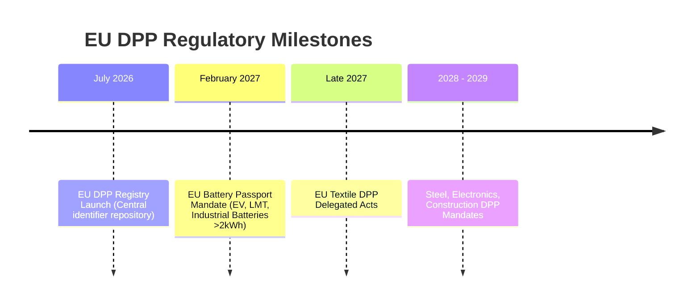

# 📘 Product Requirements Document (PRD)
## Digital Product Passport (DPP) Platform — Monkspaces

| Property | Details |
| :--- | :--- |
| **Document Title** | Product Requirements Document (PRD) — Monkspaces DPP Platform |
| **Version** | v1.0 |
| **Status** | Approved for Execution |
| **Target Regulations** | EU Battery Regulation (2023/1542), Ecodesign for Sustainable Products (ESPR 2024/1781), CEN-CLC EN 18216–18246 |
| **Primary Industry Focus** | Electric Vehicle (EV), Light Means of Transport (LMT), Industrial Batteries (Phase 1) |
| **Target Audience** | Product Managers, Engineering Teams, Executive Stakeholders, Compliance Auditors |

---

## 1. Executive Summary & Vision

### 1.1 Problem Statement
The European Union has established legally binding deadlines mandating that products sold within the EU possess a **Digital Product Passport (DPP)**. Under the **EU Battery Regulation (2023/1542)**, from **February 18, 2027**, every industrial, EV, and light-transport battery (>2 kWh) placed on the EU market must carry an electronically accessible passport via a QR code. 

Existing market solutions (Minespider, Circularise, Kezzler) are enterprise-heavy, expensive, opaque in pricing, and take 6–12 months to deploy. Mid-market manufacturers, OEMs, and tier-1/tier-2 battery pack assemblers urgently require an **affordable, turn-key, cloud-native DPP Platform** that allows them to:
1. Aggregate product specifications and supply chain compliance data (71 mandatory fields).
2. Generate GS1 Digital Link QR codes.
3. Expose structured tiered data (Public, Professional, Authority) according to EU law.
4. Maintain a 10-year immutable audit trail.

### 1.2 Product Vision
Monkspaces DPP Platform is a **multi-tenant B2B SaaS platform** enabling manufacturers to effortlessly generate, manage, publish, and audit Digital Product Passports with 100% regulatory compliance, low friction onboarding, and real-time EU DPP Registry interoperability.

---

## 2. Regulatory Foundation & Compliance Deadlines

### 2.1 The 3 Access Tiers (ESPR / Battery Regulation Mandate)
A single QR code on a physical product must resolve dynamically based on the viewer's role and authentication status:

1. **Public Tier (Unauthenticated / Consumer)**:
   - Scannable with standard smartphone camera.
   - General product identity, brand name, battery chemistry, mass, carbon footprint summary, and recycling / disposal instructions.
2. **Professional Tier (Authenticated Repairers / Remanufacturers)**:
   - Requires login.
   - Disassembly manuals, spare parts availability, safety instructions, round-trip efficiency, cycle life, internal cell chemistry.
3. **Authority Tier (Authenticated Market Surveillance Authorities)**:
   - Requires eIDAS-compliant government authentication.
   - Full test certificates, laboratory conformity documents, supply chain due diligence reports, toxic substance thresholds.

---

## 3. User Personas & Core Journeys

| Persona | Role | Key Goal | Core Journey |
| :--- | :--- | :--- | :--- |
| **Elena (OEM Admin)** | VP of Quality / Compliance at Battery Co. | Ensure full EU market access without penalties | Signs up company, creates org, invites product managers and suppliers, monitors compliance readiness. |
| **Marcus (Product Manager)** | Battery Systems Engineer | Publish compliant passports for 50+ battery SKUs | Enters technical specifications (71 fields), attaches test reports, reviews validation warnings, publishes passport, downloads QR code. |
| **Klaus (Independent Repairer)** | Certified EV Battery Remanufacturer | Safely disassemble and repair a degraded pack | Scans battery QR code, logs in with verified credentials, accesses repair guides and nominal cell voltage specs. |
| **Dr. Dupont (EU Inspector)** | Market Surveillance Authority (French DGCCRF) | Audit battery chemistry and conformity | Scans QR, authenticates via eIDAS / government token, inspects full lab test reports and manufacturer declarations. |
| **Alex (Consumer / Recycler)** | EV Owner or Scrap Recycler | Check battery life and safe recycling location | Scans QR on car door frame/battery pack, views battery chemistry and nearest certified drop-off center. |

---

## 4. Product Scope & Phasing

### Phase 1: MVP (Current Release)
- **Multi-Tenant Foundation**: Organization registration, user management, and Role-Based Access Control (RBAC).
- **Battery Schema Engine**: Full 71-field entry covering Annex VI (Public), Annex XIII (Professional), and Authority requirements.
- **Dynamic GS1 QR Code Generation**: Instant SVG/PNG QR generation encoding GS1 Digital Link standard URI (`https://domain.com/01/{GTIN}/21/{SERIAL}`).
- **3-Tier Data Separation**: Tiered JSONB storage preventing unauthorized data leakage.
- **Immutable Audit Logging**: Automatic record of every creation, edit, publication, and deletion.
- **Export Capabilities**: JSON-LD export format aligned with EU DPP standards.

### Phase 2: Supply Chain & Enterprise Sync (Next 3–6 Months)
- **Supplier Data Request Portal**: Invite suppliers via magic link to fill sub-tier material & chemical declarations.
- **Bulk CSV / Excel Import**: Upload 500+ SKUs simultaneously with schema validation.
- **EU DPP Registry API Connector**: Automated sync with European Commission central registry.
- **eIDAS Digital Signatures**: Cryptographic timestamping and PDF signing.

### Phase 3: Advanced Intelligence & Blockchain (6–12 Months)
- **AI Document Extraction**: Extract battery test reports from PDF datasheets automatically.
- **Optional DLT / Blockchain Notarization**: Proof-of-existence anchoring on public/private ledger for dispute resolution.

---

## 5. Non-Functional Requirements (NFRs)

1. **Security & Data Privacy**:
   - Zero exposure of confidential supply chain or pricing data in the public tier.
   - Password hashing with Bcrypt (salt rounds 12).
   - JWT tokens with 15-minute access expiration and secure refresh token rotation.
2. **Performance & Scalability**:
   - Public QR scan resolution response time: **< 150 ms** worldwide via CDN.
   - API response time for CRUD operations: **< 250 ms** under 95th percentile load.
3. **Availability & Data Retention**:
   - **99.9% uptime SLA**.
   - Mandatory **10-year data retention** per EU regulation, even if the manufacturing entity ceases business operations (cloud cold-storage backup).
4. **Interoperability**:
   - Data stored and exported in JSON-LD syntax complying with W3C Verifiable Credentials and GS1 standards.
