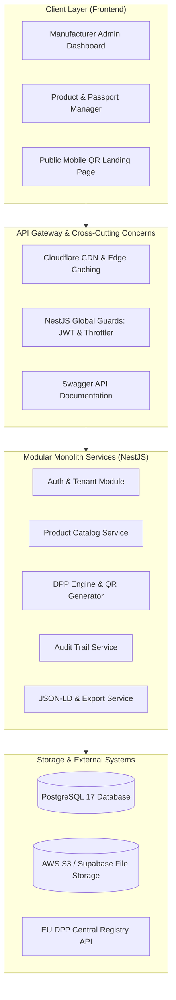
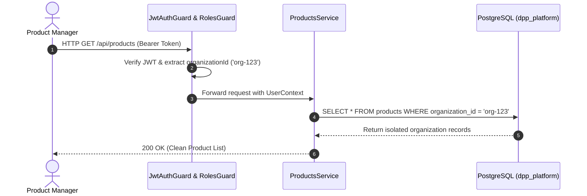
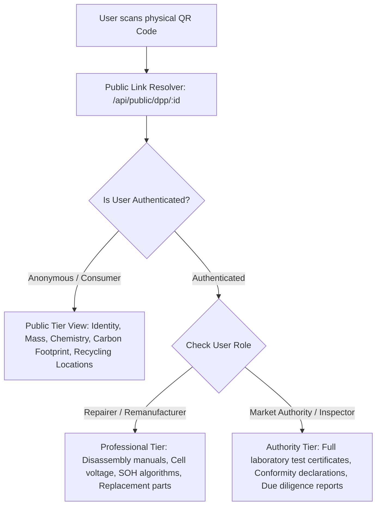

# 🏛️ High-Level Design (HLD) Document
## Digital Product Passport (DPP) Platform — Monkspaces

| Property | Details |
| :--- | :--- |
| **Document Title** | High-Level Design (HLD) Specification |
| **System Name** | Monkspaces DPP Platform |
| **Architecture Pattern** | Modular Monolith (Cloud-Native, Multi-Tenant) |
| **Technology Stack** | Angular 17, NestJS 10, PostgreSQL 17, TypeORM 0.3, Docker, Cloudflare |
| **Version** | v1.0 |

---

## 1. Architectural Strategy & Design Principles

The platform follows a **Modular Monolith** architecture:
- **Why Monolith First?** Minimizes network overhead, avoids distributed transaction complexity, enables fast schema refactoring during early regulatory iterations, and dramatically reduces initial DevOps overhead.
- **Why Modular?** Every domain module (`auth`, `organizations`, `users`, `products`, `dpps`, `audit`, `export`) is strictly decoupled. Communication between modules happens through well-typed interfaces, enabling seamless extraction into microservices if individual domains (such as public QR scans) experience hyper-scale.



---

## 2. Multi-Tenancy & Data Isolation Model

Multi-tenancy is implemented using a **Shared Database, Shared Schema with Tenant ID Discriminator** approach:
1. **Tenant Identification**: Every organization has a unique `id` (UUID) and `tenant_id` (UUID).
2. **Row-Level Tenancy**: All primary domain tables (`users`, `products`, `dpps`, `audit_logs`) contain an `organization_id` foreign key.
3. **Guard Enforcement**:
   - The user's authenticated JWT carries `{ organizationId, sub, role }`.
   - The NestJS request context extracts this `organizationId`.
   - All repository queries automatically scope with `.where({ organization_id: currentOrgId })`.



---

## 3. Tiered Data Access Pipeline (EU Compliance)

To satisfy the EU Ecodesign and Battery Regulation, data visibility must be strictly segregated across 3 tiers:



### Storage Implementation:
In the `dpps` table, data is partitioned into distinct JSONB columns:
- `public_data`: Unrestricted JSON payload.
- `professional_data`: Sensitive repair, performance, and circularity specs.
- `authority_data`: Confidential legal compliance and toxic substance dossiers.

---

## 4. Authentication, Authorization & Security Architecture

1. **Password Security**: Passwords hashed with `bcrypt` (12 salt rounds).
2. **Token Lifecycle**:
   - **Access Token (JWT)**: 15-minute lifespan, signed with HMAC-SHA256, contains identity & roles.
   - **Refresh Token (JWT)**: 7-day lifespan, used exclusively at `/api/auth/refresh` to mint fresh access tokens.
3. **Role-Based Access Control (RBAC)**:
   - `super_admin`: Platform-wide operator (tenant provisioning, health monitoring).
   - `org_admin`: Tenant administrator (invites users, manages subscriptions).
   - `product_manager`: Creates and edits products, generates DPPs, uploads files.
   - `compliance`: Reviews conformity documents, approves passport publication.
   - `viewer`: Read-only access to organization products.
4. **Brute Force Defense**: `ThrottlerModule` enforces rate limits (e.g., max 10 login attempts per second).

---

## 5. Audit Logging Architecture (Immutable Ledger)

To meet the EU's 10-year verification requirements, an immutable audit log is maintained:
- Every mutation (Create, Update, Delete, Publish, Status Transition) triggers `AuditService.log()`.
- Captures: `organization_id`, `user_id`, `entity_type`, `entity_id`, `action`, `old_data` (JSONB), `new_data` (JSONB), `ip_address`, and `user_agent`.
- **Database Level Constraint**: The `audit_logs` table has a database rule rejecting any `UPDATE` or `DELETE` SQL operations.

---

## 6. Deployment & Infrastructure Architecture

```
                  ┌────────────────────────┐
                  │    Internet Traffic    │
                  └───────────┬────────────┘
                              │ HTTPS (Port 443)
                              ▼
                  ┌────────────────────────┐
                  │ Cloudflare DNS & CDN   │
                  │ (SSL, WAF, Edge Cache) │
                  └───────────┬────────────┘
                              │
            ┌─────────────────┴─────────────────┐
            │                                   │
            ▼                                   ▼
┌────────────────────────┐         ┌────────────────────────┐
│   Frontend Host        │         │   Backend Host         │
│   (Vercel / Cloudflare)│         │   (Render / Docker / VM)│
│   Angular 17 SPA       │         │   NestJS Modular API   │
│   Port: 80 / 443       │         │   Port: 3000           │
└────────────────────────┘         └───────────┬────────────┘
                                                │
                                    ┌───────────┴────────────┐
                                    │                        │
                                    ▼                        ▼
                        ┌────────────────────────┐ ┌──────────────────┐
                        │ PostgreSQL 17 Database │ │ AWS S3 / Supabase│
                        │ (dpp_platform)         │ │ (PDFs, Images,   │
                        │ Port: 5432             │ │  Certificates)   │
                        └────────────────────────┘ └──────────────────┘
```
