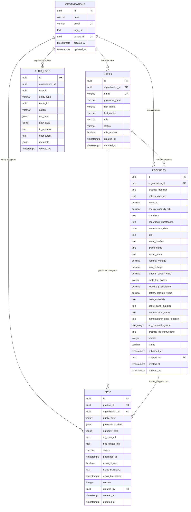
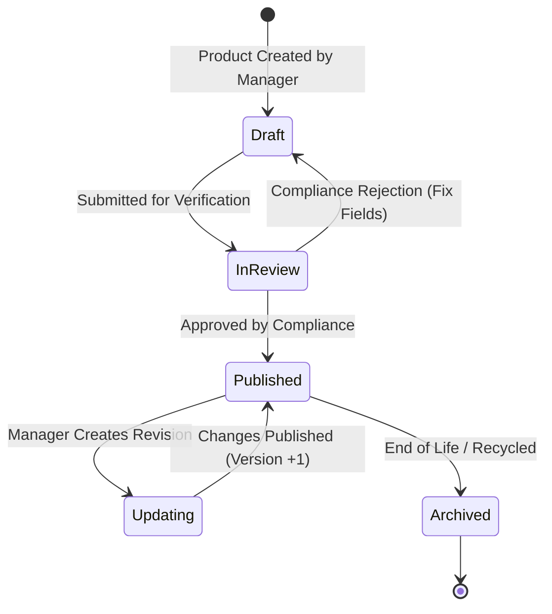
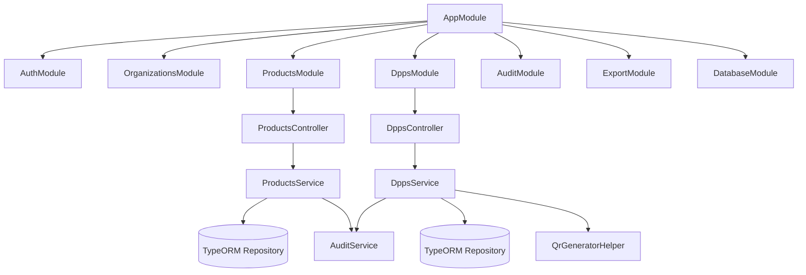

# 🔬 Low-Level Design (LLD) Document
## Digital Product Passport (DPP) Platform — Monkspaces

| Property | Details |
| :--- | :--- |
| **Document Title** | Low-Level Design (LLD) & Data Model Specification |
| **Database Engine** | PostgreSQL 17 |
| **ORM** | TypeORM 0.3 |
| **Backend Framework** | NestJS 10 (TypeScript 5.3) |
| **Status** | Implemented & Active in `dpp_platform` DB |

---

## 1. Database Entity-Relationship (ER) Diagram

---

## 2. Table Specifications & Constraints

### 2.1 `organizations`
Stores tenant profiles. Each business operating on the platform has one record here.
- `id` (UUID, Primary Key, generated via `uuid_generate_v4()`).
- `name` (VARCHAR, NOT NULL): Legal business name.
- `email` (VARCHAR, UNIQUE, NOT NULL): Organization primary contact email.
- `tenant_id` (UUID, UNIQUE, NOT NULL): External tenant GUID.
- `logo_url` (TEXT, NULLABLE): Hosted logo URL for branded public passport pages.

### 2.2 `users`
Stores user credentials, profiles, and permissions.
- `organization_id` (UUID, FOREIGN KEY -> `organizations.id` ON DELETE SET NULL).
- `role` (VARCHAR, DEFAULT 'viewer'): CHECK constraint: `['super_admin', 'org_admin', 'product_manager', 'compliance', 'viewer']`.
- `password_hash` (VARCHAR, NOT NULL): 60-character bcrypt hash string.

### 2.3 `products` (71 Regulatory Fields)
Categorized according to EU Battery Regulation Annex VI & XIII:
- **Public Core**:
  - `product_identifier`: GS1 Digital Link standard URI.
  - `battery_category`: `EV` (Electric Vehicle), `LMT` (Light Means of Transport), or `Industrial`.
  - `mass_kg`: Product weight with 3-decimal precision (e.g., `450.250`).
  - `energy_capacity_wh`: Total capacity (e.g., `75000.000` Wh = 75 kWh).
  - `chemistry`: Chemistry taxonomy (e.g., `NMC 811`, `LFP`, `Solid State`).
  - `manufacture_date`: ISO Date (`YYYY-MM-DD`).
  - `gtin` & `serial_number`: Global Trade Item Number (GS1 standard) and serial.
- **Professional Core (Annex XIII)**:
  - `nominal_voltage` & `max_voltage`: Operating electrical thresholds.
  - `original_power_watts`: Rated power output.
  - `cycle_life_cycles`: Minimum guaranteed full charge/discharge cycles.
  - `round_trip_efficiency`: Energy efficiency percentage (e.g., `92.50%`).
  - `parts_materials` & `spare_parts_supplier`: Commercial contact and dismantling details.
- **Authority Core**:
  - `eu_conformity_docs`: Array of S3 URLs to CE certificates & ISO test reports.
  - `manufacturer_plant_location`: Physical manufacturing coordinates/address.

### 2.4 `dpps`
Stores the active Digital Product Passports linked to products:
- `product_id` (UUID, FOREIGN KEY -> `products.id` ON DELETE CASCADE).
- `public_data`, `professional_data`, `authority_data` (JSONB): Pre-computed snapshots of tiered data for fast read-performance.
- `qr_code_url`: Hosted SVG/PNG barcode file.
- `gs1_digital_link`: Full web URI encoded in the QR.
- `status`: `draft` | `published` | `archived`.

### 2.5 `audit_logs`
Immutable record of system activities.
- Immutability enforced in PostgreSQL: No UPDATE or DELETE permitted.
- `old_data` & `new_data` store state diffs for audit reconstitution.

---

## 3. Product & Passport State Machine

---

## 4. Backend Class & Injection Architecture

