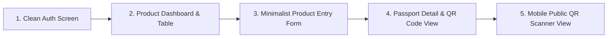

# 🖥️ Minimalist Frontend UX & Interaction Flow
## Digital Product Passport (DPP) Platform — Monkspaces

| Property | Details |
| :--- | :--- |
| **Document Title** | Minimalist Frontend Architecture & Screen Flow Guide |
| **Philosophy** | **Functional First, Minimalist, High Speed, Low Clutter** |
| **Framework** | Angular 17 + Angular Material |
| **Target** | Fast MVP testing and seamless backend integration |

---

## 1. Design Philosophy: "Functional-First Minimalist"

> *"Kyunki abhi screens change ho sakti hain, isliye over-engineering aur heavy styling se bachenge. Humara primary focus hai: 100% working functionality, clean layout, aur zero friction."*

### Key Rules:
1. **Clean & Lightweight**: Minimalist color palette (Slate Blue, Dark Grey, White, Forest Green for status).
2. **Speed Over Decoration**: No heavy decorative graphics or blocking animations. Fast page transitions.
3. **Component Reusability**: All buttons, inputs, and status badges use standard Angular Material tokens.
4. **Resilient to UI Changes**: Business logic and API calls remain decoupled in `core/` services, allowing any future UI redesign without rewriting backend connection logic.

---

## 2. Core User Journey & 4 Essential Screens



---

## 3. Screen-by-Screen Specifications

### Screen 1: Minimalist Login / Signup (`/login`)
- **Purpose**: Authenticate user and store JWT token in `localStorage`.
- **Layout**: Centered card on a clean neutral background.
- **Fields**:
  - Email input (validation: valid email format)
  - Password input (masked)
  - "Sign In" primary button
  - Small toggle link: *"Need an account? Register organization"*
- **Feedback**: Simple inline toast error on invalid credentials; smooth redirect to `/dashboard` on success.

---

### Screen 2: Product & Passport Table (`/dashboard`)
- **Purpose**: Overview of all products and their passport publication status.
- **Layout**:
  - Top Bar: Company Name, User Profile pill, Logout button.
  - Action Bar: "New Product" primary button + Search bar.
  - Minimalist Table Columns:
    1. **Model & Brand** (`model_name`, `brand_name`)
    2. **Battery Category** (`EV`, `LMT`, `Industrial`)
    3. **Chemistry** (`NMC 811`, `LFP`, etc.)
    4. **Status Badge**:
       - 🟡 `Draft` (Yellow chip)
       - 🟢 `Published` (Green chip)
       - ⚪ `Archived` (Grey chip)
    5. **Passport Actions**:
       - "View Passport" (Opens Screen 4)
       - "Generate QR" (If passport not yet generated)
       - "Edit"

---

### Screen 3: Sectioned Product Entry Wizard (`/products/new`)
- **Purpose**: Enter the required technical specifications for EU compliance without feeling overwhelmed.
- **Layout**: Clean collapsible accordion or 3 simple tabs:
  - **Tab 1: Basic Information (Public Tier)**:
    - Model Name, Brand Name, Battery Category (Dropdown: EV / LMT / Industrial)
    - GTIN, Serial Number, Manufacture Date, Chemistry
    - Total Mass (kg), Energy Capacity (Wh)
  - **Tab 2: Electrical & Lifecycle Specs (Professional Tier)**:
    - Nominal Voltage (V), Maximum Voltage (V), Rated Power (W)
    - Cycle Life (cycles), Round-trip Efficiency (%)
  - **Tab 3: Compliance & Manufacturer (Authority Tier)**:
    - Manufacturer Name, Manufacturing Plant Location
    - Hazardous Substances description
    - File upload for EU Declaration of Conformity (PDF)
- **Footer**: "Save as Draft" (Secondary) and "Save & Generate Passport" (Primary).

---

### Screen 4: Passport Preview & Printable QR Code (`/passports/:id`)
- **Purpose**: Display the generated Digital Product Passport with real-time QR code.
- **Layout**:
  - Left Column: Digital passport data preview categorized into 3 expandable visibility tiers.
  - Right Column:
    - Crisp high-resolution QR code preview.
    - GS1 Digital Link text link (`https://dpp.monkspaces.com/01/...`).
    - "Download QR Code (PNG / SVG)" button.
    - "Publish Live Passport" button (with confirmation modal).

---

### Screen 5: Public Mobile Landing Page (`/p/:identifier`)
- **Purpose**: The page that opens when anyone (consumer, repairer, regulator) scans the QR code with their mobile phone.
- **Layout**:
  - Clean mobile-responsive single column.
  - Header: Product Name + Battery Category badge.
  - Section 1: Carbon Footprint & Mass summary.
  - Section 2: Chemistry & Safety Guidelines.
  - Section 3: Safe Disposal & Recycling Centers near user.
  - Bottom Bar: *"Are you an authorized repairer or EU inspector? Log in for technical data."*

---

## 4. Frontend Directory Structure

```
frontend/src/app/
├── core/                        # Singleton services & interceptors
│   ├── auth.service.ts          # Login, JWT storage, user session
│   ├── product.service.ts       # Product CRUD HTTP calls
│   ├── dpp.service.ts           # Passport & QR HTTP calls
│   └── guards/auth.guard.ts     # Route protection
├── features/                    # Functional feature views
│   ├── auth/                    # Login & Register views
│   ├── dashboard/               # Product table & stats
│   ├── products/                # Product entry form
│   └── passports/               # Passport preview & QR code
└── shared/                      # Minimal reusable widgets
    ├── material.module.ts       # Angular Material imports
    └── components/              # Status badge, simple buttons
```
