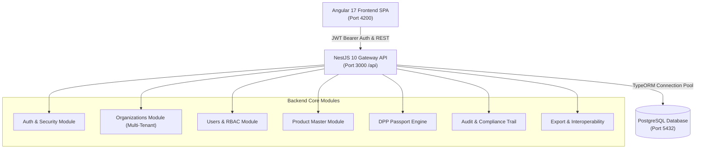

# Digital Product Passport (DPP) Platform — System Modules Documentation

> **Document Version**: 1.0.0 (October 2026)  
> **Platform**: **Monkspaces DPP Enterprise Platform**  
> **Repository**: `DPP-Platform`  
> **Compliance Standards**: EU Battery Regulation (EU) 2023/1542 & EU ESPR (Ecodesign for Sustainable Products Regulation)

---

## 1. System Architecture Overview

The platform is structured as an enterprise-grade, multi-tenant Digital Product Passport engine. It couples a secure **NestJS 10 + TypeORM + PostgreSQL** backend with a modern **Angular 17** responsive frontend design system.

---

## 2. Implemented Modules Breakdown

### Module 1: Authentication & Security (`AuthModule`)
Handles user identity verification, secure credential storage, and JWT token issuance.

* **Core Features**:
  * Dual-token authentication (Access Token + Refresh Token).
  * Industry-standard `bcrypt` hashing (salt rounds: 10–12).
  * Role Guards (`RolesGuard`) and JWT Bearer validation (`JwtAuthGuard`).
  * Rate-limiting via `ThrottlerModule` and HTTP security headers via `Helmet`.
* **API Endpoints**:
  * `POST /api/auth/login`: Authenticates email/password, returns access & refresh tokens.
  * `POST /api/auth/register`: Onboards new users.
  * `POST /api/auth/refresh`: Refreshes expired sessions.
  * `GET /api/auth/me`: Retrieves current authenticated user profile.
* **Frontend Implementation**:
  * `frontend/src/app/features/auth/login/login.component.ts`: Enterprise sign-in form with reactive validation, password visibility toggling, error handling, and toast feedback.

---

### Module 2: Multi-Tenant Company Management (`OrganizationsModule`)
Manages multi-tenant corporate entities, guaranteeing complete data isolation between different enterprises while allowing Super Admin governance.

* **Database Table**: `organizations`
  * Columns: `id` (UUID), `name`, `email`, `logo_url`, `tenant_id`, `created_at`, `updated_at`.
* **Key Capabilities**:
  * **Super Admin Mode**: Cross-tenant visibility across all companies.
  * **Org Admin Mode**: Strict tenant confinement to their own company workspace.
* **API Endpoints**:
  * `GET /api/orgs`: Lists accessible organizations.
  * `GET /api/orgs/:id`: Detailed view of organization and its assigned users.
  * `POST /api/orgs`: Registers new corporate entity (Super Admin only).
  * `PUT /api/orgs/:id`: Updates company metadata.
* **Key Files**:
  * Backend Controller: `backend/src/organizations/organizations.controller.ts`
  * Backend Service: `backend/src/organizations/organizations.service.ts`

---

### Module 3: User Management & Access Control (`UsersModule` & `AccessControlModule`)
Full lifecycle governance of team members with fine-grained Role-Based Access Control (RBAC).

* **Database Table**: `users`
  * Columns: `id`, `email`, `first_name`, `last_name`, `password_hash`, `role`, `status`, `organization_id`, `created_at`.
  * Roles: `super_admin`, `org_admin`, `product_manager`, `compliance`, `viewer`.
* **Key Capabilities**:
  * User invitation and onboarding workflow.
  * Role escalation protection (only Super Admins can grant Super Admin privileges).
  * Organization-level member isolation.
* **Frontend Access Control Interface**:
  * `frontend/src/app/features/access-control/access-control.component.ts`
  * Interactive Organization filter tabs (filter users by company).
  * Live search and status filter tabs.
  * "Invite Member" modal dialog with role selector.
* **API Endpoints**:
  * `GET /api/users`: Lists users (filtered by permissions/tenant).
  * `GET /api/users/:id`: Fetches user profile.
  * `POST /api/users`: Creates or invites a new member with auto-generated credentials.
  * `PUT /api/users/:id`: Updates member profile, role, or active status.
  * `DELETE /api/users/:id`: Removes member from organization.

---

### Module 4: Product Master Management (`ProductsModule`)
Central catalog holding master records required before generating any Digital Product Passport.

* **Compliance Alignment**: EU Battery Regulation (EU) 2023/1542 (Annex VI & XIII) and EU ESPR multi-industry taxonomy.
* **Database Table**: `products`
  * **Public Fields**: `product_identifier` (GS1 Link), `battery_category`, `brand_name`, `model_name`, `mass_kg`, `energy_capacity_wh`, `chemistry`, `gtin`, `serial_number`.
  * **Professional Fields**: `nominal_voltage`, `max_voltage`, `original_power_watts`, `cycle_life_cycles`, `round_trip_efficiency`, `battery_lifetime_years`, `spare_parts_supplier`.
  * **Authority Fields**: `manufacturer_name`, `manufacturer_plant_location`, `eu_conformity_docs`, `product_life_instructions`.
  * **Audit Metadata**: `version`, `status` (`draft` / `published` / `archived`), `published_at`, `created_by`.
* **API Endpoints**:
  * `GET /api/products`: Filterable list with pagination (`page`, `limit`, `search`, `category`, `status`).
  * `GET /api/products/:id`: Full technical spec of product.
  * `POST /api/products`: Creates new product master record with initial draft version.
  * `PUT /api/products/:id`: Updates specifications and increments version counter.
  * `POST /api/products/:id/publish`: Transitions product to published state.
* **Key Files**:
  * Backend Controller: `backend/src/products/products.controller.ts`
  * Backend Service: `backend/src/products/products.service.ts`
  * Frontend Service: `frontend/src/app/core/product.service.ts`
  * Frontend UI: `frontend/src/app/features/products/product-library/product-library.component.ts`

---

### Module 5: Digital Product Passport Engine (`DppsModule` & Wizard)
The passport generation core that links products to immutable GS1 Digital Links, generates QR codes, and segments data by stakeholder visibility tier.

* **Database Table**: `dpps`
  * Columns: `id`, `product_id`, `organization_id`, `public_data` (JSONB), `professional_data` (JSONB), `authority_data` (JSONB), `qr_code_url`, `gs1_digital_link`, `status`, `version`, `eidas_signed`, `eidas_signature`.
* **Data Tiers**:
  | Tier | Intended Audience | Content Examples |
  | :--- | :--- | :--- |
  | **Public** | Consumers, general public | Model, brand, chemistry, mass, recycle instructions, GS1 QR link |
  | **Professional** | Dismantlers, repairers, second-life integrators | Voltage specs, cycle life, dismantling manuals, spare parts |
  | **Authority** | Market surveillance authorities, EU customs | Full conformity certificates, test reports, safety declarations |
* **Key Files**:
  * Backend Service: `backend/src/dpps/dpps.service.ts`
  * Frontend Wizard: `frontend/src/app/features/passports/dpp-wizard/dpp-wizard.component.ts` (Step-by-step creation flow)

---

### Module 6: Audit & Compliance Trail (`AuditModule`)
Enterprise compliance tracker that logs every administrative and catalog mutation for auditability.

* **Database Table**: `audit_logs`
  * Columns: `id`, `organization_id`, `user_id`, `action` (`create`, `update`, `delete`, `publish`), `entity_type` (`product`, `dpp`), `entity_id`, `changes` (JSONB before/after diff), `created_at`.
* **API Endpoints**:
  * `GET /api/audit`: Query recent organization audit events.
  * `GET /api/audit/entity/:entityType/:entityId`: Full event timeline for a specific product or passport.

---

### Module 7: Export & Interoperability (`ExportModule`)
Enables cross-platform exchange with regulatory portals, supply chain partners, and customs.

* **Features**:
  * **JSON-LD Schema**: W3C and GS1 conforming linked-data representations.
  * **Bulk CSV Export**: High-volume tabular downloads for ERP integration.
  * Public QR resolver endpoint.
* **API Endpoints**:
  * `GET /api/export/products/:id/jsonld`
  * `GET /api/export/dpps/:id/jsonld`
  * `GET /api/export/products/csv`
  * `GET /api/export/dpps/csv`

---

### Module 8: Design System & Theming Engine
Frontend foundation adhering to modern design standards with zero reliance on generic templates.

* **Reusable UI Components**:
  * `app-stat-card`: Metric cards with trends, icon accents, and subtitles.
  * `app-progress-bar`: Animated percentage completion bar with thresholds.
  * `app-search-input`: Debounced live-filtering search input.
  * `app-filter-tabs`: Segmented pill selector with counters.
* **Dynamic Theme Presets**:
  * `Monk Minimal` (Clean enterprise light)
  * `Dark Emerald` (High-contrast sustainable dark mode)
  * `Nordic Clean` (Soft slate minimalist)
  * `Cyberpunk Slate` (High-tech contrast)

---

## 3. Summary Status Matrix

| Module | Backend API | Database Tables | Frontend UI | Production Readiness |
| :--- | :---: | :---: | :---: | :---: |
| **Authentication** | ✅ Complete | ✅ `users` | ✅ Login Screen | 100% |
| **Organizations (Company)** | ✅ Complete | ✅ `organizations` | ✅ Access Control Tabs | 100% |
| **Users & RBAC** | ✅ Complete | ✅ `users` | ✅ Access Control Screen | 100% |
| **Product Master** | ✅ Complete | ✅ `products` | ⚠️ Route & Dialog pending | 90% |
| **DPP Passport Engine** | ✅ Complete | ✅ `dpps` | ⚠️ Wizard Hookup pending | 85% |
| **Audit Trail** | ✅ Complete | ✅ `audit_logs` | ⏳ Background / Integrated | 95% |
| **Export / Interop** | ✅ Complete | N/A (Derived) | ⏳ Direct Link Ready | 90% |
| **OpenAPI / Swagger** | ✅ Complete | Live on `/api/docs` | N/A | 100% |

---

## 4. Default Credentials & Test Endpoints

* **Backend Swagger URL**: `http://localhost:3000/api/docs`
* **Frontend Web App**: `http://localhost:4200`
* **Default Super Admin**:
  * Email: `admin@monkspaces.com`
  * Password: `MonkPass2026!`
* **Default Org Admin**:
  * Email: `raman@monkspaces.com`
  * Password: `MonkPass2026!`
