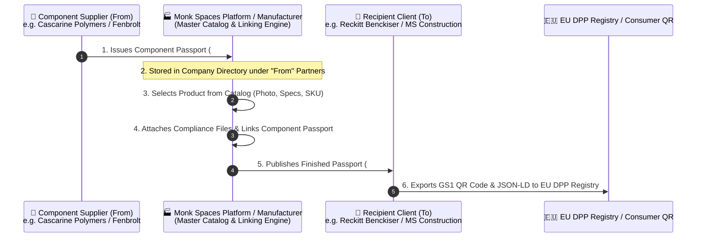

# 🏢 Monk Spaces DPP Architecture & Custom Business Flow Guide
## Digital Product Passport (DPP) Platform — Multi-Tier Supply Chain & Custom UI

| Attribute | Details |
| :--- | :--- |
| **System Name** | Monk Spaces Digital Product Passport (DPP) Platform |
| **Version** | v2.0 (Custom Supply Chain Flow) |
| **Document Purpose** | Official specification of the real Monk Spaces supply chain handshake, "From & To" company mechanics, visual product catalog, and differentiated UI structure. |
| **Target Audience** | Engineering Team, Product Architects, Demo Stakeholders |

---

## 1. Executive Vision: Why We Differentiate from Competitors

Standard competitors (such as Minespider or Kezzler) often treat a DPP as an isolated document or a static database record. 

However, **Monk Spaces' true operational model** recognizes that:
1. **Passports are Transferred across Companies**: Every DPP is an exchange between an **Issuer / Component Supplier ("From")** and a **Recipient / Customer ("To")**.
2. **Chain of Custody Provenance (Linking)**: Finished products (e.g. Dettol antiseptic formulation or a Battery Pack) incorporate sub-tier component passports (e.g. PET bottles, chemical feedstocks, lithium cells).
3. **Visual Product Master**: Operators select products visually, equipped with high-resolution product photographs, SKU/GTIN codes, material compositions, and physical specifications.
4. **Distinct, Non-Derivative UI**: Monk Spaces does not copy competitor jargon. Our interface reflects clean, enterprise-grade clarity designed specifically for super administrators, procurement leads, and compliance auditors.

---

## 2. The End-to-End "To & From" Passport Handshake

---

## 3. Custom Sidebar Navigation Structure

Instead of the competitor's generic layout (`Dashboard`, `Product Passports`, `Access Control`, `Product Library`), Monk Spaces provides a bespoke operational hierarchy:

| Menu Item | Route | Icon | Core Functionality |
| :--- | :--- | :--- | :--- |
| **Operations Hub** | `/dashboard` | `insights` | Real-time carbon metrics, passport velocity, recent transfers feed |
| **Digital Passports** | `/product-passports` | `qr_code_2` | Complete passport register with "From" & "To" companies, linking badges |
| **Company Management** | `/company-management` | `domain` | Directory of suppliers ("From"), clients ("To"), and circular recyclers |
| **Product Management** | `/product-management` | `inventory_2` | Master product catalog with photographs, mass/volume, SKU, and specs |
| **User Management** | `/user-management` | `manage_accounts` | Super admins, org admins, compliance officers, and role-based permissions |
| **Platform Settings** | `/settings` | `settings` | Tenant branding, API keys, certificate authorities, and audit options |

---

## 4. Screen-by-Screen Specifications for Tomorrow's Deliverables

### 4.1 Company Management (`/company-management`)
- **Key Entities**:
  - **Suppliers ("From")**: E.g., *Cascarine Polymers*, *Fenbrolt Specialty Chemicals*, *Bharat Ore Mines*.
  - **Internal / Manufacturing**: *Monkspaces Technologies*, *Monk Power Systems*.
  - **Recipients ("To")**: *Reckitt Benckiser Private Limited*, *MS Construction*.
  - **Circular Takeback**: *Suraksha Scrap Traders*.
- **Features**:
  - Entity cards and data tables displaying country flags (🇮🇳, 🇩🇪, 🇳🇱, 🇬🇧).
  - Business registration numbers (CIN, KVK, VAT, GSTIN).
  - Linked passports counter (showing how many active passports flow through each partner).
  - Modal to register a new partner company with full role classification.

### 4.2 Product Management (`/product-management`)
- **Visual Product Records**:
  - Real photographic asset preview (e.g. *Dettol bottle*, *Titan-EV pack*, *PET bottle*, *Lyocell fiber*).
  - Category classification: *Batteries & Energy*, *Packaging & Polymers*, *Chemicals & Minerals*, *Textiles*.
  - Item classification: *Custom SKU*, *Sub-tier Component*, *Raw Material Feedstock*.
  - Mass & chemical composition summary pill.
  - Quick action to initiate passport creation directly for that product.
  - Modal to create and store new product master records.

### 4.3 User Management & RBAC (`/user-management`)
- **Identity & Governance**:
  - Multi-tier role separation: `Super Admin`, `Org Admin`, `Compliance Officer`, `Auditor`.
  - Organization assignment to ensure data segregation across multi-tenant clients.
  - Provisioning modal with email validation and instant invitation capability.

---

## 5. Technical Integration with Backend Services

All frontend modules communicate directly with the NestJS/PostgreSQL backend:
- **Companies**: Interacts with `/api/orgs` (PostgreSQL `organizations` table).
- **Products**: Interacts with `/api/products` (PostgreSQL `products` table).
- **Users**: Interacts with `/api/users` (PostgreSQL `users` table).
- **Passports**: Interacts with `/api/dpps` (PostgreSQL `dpps` table with JSONB tiered data).
