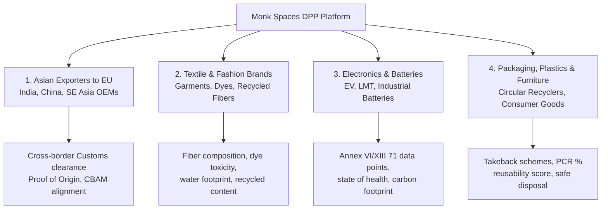
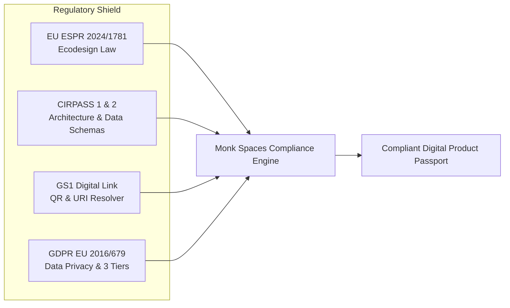
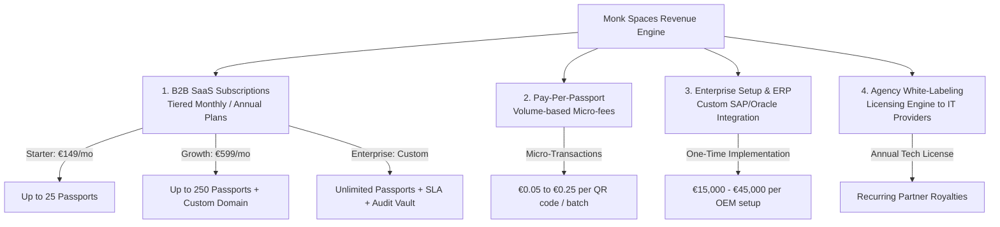

# 🌐 Digital Product Passport (DPP) — Guidelines, Regulatory Compliance & Strategy Guide
## Monk Spaces Platform — Strategic Blueprint aligned with EU ESPR, CIRPASS, and Global Standards

| Attribute | Details |
| :--- | :--- |
| **Document Title** | DPP Platform Strategic Guidelines & Global Compliance Roadmap |
| **Regulatory Frameworks** | EU ESPR (2024/1781), CIRPASS-1 / CIRPASS-2 Consortium Standards, EU Battery Regulation (2023/1542), CEN-CENELEC EN 18216–18246, GDPR (EU 2016/679) |
| **Identification Standards** | GS1 Digital Link URI Standard, GTIN-13 / GTIN-14, EPCIS 2.0 (Supply Chain Events) |
| **Audience** | Product Leadership, Enterprise Sales, Core Engineering, Compliance Auditors |
| **Status** | Active Operating Blueprint |

---

## 1. Target Audience Segmentation (Kinke Liye Banayenge?)

The Monk Spaces DPP Platform is engineered for 4 primary customer segments where European Union compliance is legally mandatory:



### 1.1 Segment Profiles & Urgent Drivers:
1. **EU Exporters (Asian Manufacturers & Suppliers)**:
   - *Problem*: Indian, Chinese, and Vietnamese factories exporting goods into Germany, France, and Nordic countries risk container seizures at EU ports if products lack a machine-readable DPP starting 2027.
   - *Solution*: Low-friction SaaS enabling exporters to generate EU-compliant GS1 Digital Link passports in minutes.
2. **Textile & Fashion Brands**:
   - *Problem*: ESPR mandates tracing fiber origin, hazardous chemical dyes (REACH compliance), and microplastic shedding.
   - *Solution*: Material breakdown tracking (e.g. Lyocell, organic cotton, polyester) with supplier declaration signatures.
3. **Batteries & Clean Mobility**:
   - *Problem*: First mandatory deadline (**February 18, 2027**). Every industrial and EV battery (>2 kWh) requires 71 specific parameters across 3 access tiers.
   - *Solution*: Battery passport wizard with pre-built Annex VI/XIII compliance schemas.
4. **Packaging, Plastics & Circular Economy**:
   - *Problem*: EU Packaging and Packaging Waste Regulation (PPWR) requiring post-consumer recycled (PCR) content declarations and verified recyclability scores.
   - *Solution*: Chain of Custody tracking connecting polymer resin suppliers (Cascarine Polymers) with bottle converters and brand owners (Reckitt Benckiser).

---

## 2. Guidelines & Regulatory Compliance Framework



### 2.1 ESPR (Ecodesign for Sustainable Products Regulation 2024/1781)
- **Mandatory Requirements**:
  - Requires physical data carrier (QR Code / Data Matrix) permanently affixed to product or packaging.
  - Data must remain accessible for **product lifetime + 10 years**, even if the manufacturer ceases trading.
  - Prohibition of destroying unsold textiles and footwear.
  - Mandatory synchronization with the **European Commission Central DPP Registry** (operational July 2026).
- **Monk Spaces Implementation**:
  - Automated cold-storage backup ensuring 10-year immutable audit retention.
  - Microservice-ready sync with EU central registry REST APIs.

### 2.2 CIRPASS (Collaborative Initiative for a Standards-based DPP)
- **Consortium Specifications (CIRPASS 1 & CIRPASS 2)**:
  - Standardized semantic web formats: **JSON-LD (JavaScript Object Notation for Linked Data)**.
  - Decentralized identity management using W3C DIDs (Decentralized Identifiers) and Verifiable Credentials (VC).
  - Interoperability across heterogeneous industry systems through CEN-CENELEC EN 18216–18246 harmonised standards.
- **Monk Spaces Implementation**:
  - Native JSON-LD export schema endpoints (`/api/export/products/:id/jsonld` and `/api/public/jsonld/:identifier`).
  - Standardized JSON schema validation against CIRPASS core cross-sectoral vocabulary.

### 2.3 GS1 Standards & Digital Link
- **Resolution Architecture**:
  - Eliminates proprietary, dead-end URLs by encoding GS1 Application Identifiers (AI) into web URIs:
  ```text
  https://dpp.monkspaces.com/01/{GTIN}/21/{SERIAL_NUMBER}?10={BATCH}
  ```
  - `01` = Global Trade Item Number (GTIN-13/14)
  - `21` = Serial Number (Individual unit traceability)
  - `10` = Batch / Lot Number
- **Monk Spaces Implementation**:
  - Built-in dynamic SVG/PNG vector QR generator formatting standard GS1 Digital Links for print & packaging.

### 2.4 GDPR & Data Privacy (3-Tier Access Shield)
- Under European privacy law, proprietary B2B pricing, supply chain supplier names, and consumer personal data must never be leaked through a public QR scan.
- **Monk Spaces 3-Tier Security Matrix**:
  1. **Tier 1 (Public / Unauthenticated)**: General consumer data (Materials, Carbon kg CO2e, Recycling centers, Safe disposal).
  2. **Tier 2 (Professional / Authenticated)**: Repair manuals, cell chemistry, technical schematics, spare parts suppliers.
  3. **Tier 3 (Authority / eIDAS Verified)**: Full test lab certificates, hazardous substance declarations, supply chain due diligence reports.

---

## 3. Technical Architecture & Hybrid Data Model

```
┌────────────────────────────────────────────────────────┐
│                   FRONTEND (Angular 17)                │
│  Operations Hub • Company Directory • Product Master  │
│  User RBAC • QR Resolution View (Mobile & Desktop)     │
└───────────────────────────┬────────────────────────────┘
                            │ REST / JSON-LD / JWT
┌───────────────────────────▼────────────────────────────┐
│                    BACKEND (NestJS / Node.js)          │
│  Auth Guards (RBAC) • GS1 QR Engine • Audit Logging    │
│  Carbon Calculator Service • ERP Connector Engine      │
└───────────────────────────┬────────────────────────────┘
                            │ TypeORM
┌───────────────────────────▼────────────────────────────┐
│             HYBRID DATABASE (PostgreSQL 17 + JSONB)    │
│  Relational Integrity: Users, Orgs, Billing, Roles     │
│  Flexible NoSQL (MongoDB-like): JSONB Tiered Schemas   │
│  Immutable Audit Logs: 10-Year Chain of Custody        │
└────────────────────────────────────────────────────────┘
```

### 3.1 Why PostgreSQL with JSONB gives us the best of both worlds (Relational + NoSQL):
- **MongoDB Atlas Flexibility**: Each product sector (Batteries vs Textiles vs Plastics) has completely different fields. In PostgreSQL, our `public_data`, `professional_data`, and `authority_data` columns are stored as **native JSONB**. This provides schema-free document flexibility without maintaining two separate database clusters.
- **Relational Rigor**: User accounts, organizations, multi-tenant billing, and foreign-key relations (e.g. `product_id -> organization_id`) retain strict ACID transactional integrity.

### 3.2 Enterprise ERP Integration Roadmap (Overcoming the "Hard" Challenge):
- **Phase 1 (Active)**: Manual entry + instant CSV/Excel batch upload with JSON-LD conversion.
- **Phase 2 (Months 3–6)**: Standard Webhooks & REST Ingestion APIs for SAP S/4HANA and Oracle Cloud ERP.
- **Phase 3 (Enterprise)**: GS1 EPCIS event listener syncing real-time inventory and shipping handshakes.

### 3.3 Blockchain & Decentralized Anchoring (Advanced Immutability):
- Store product passports in fast cloud databases for millisecond QR scan latency (<150ms).
- Anchor cryptographic hashes (Merkle roots) of passport batches to an EVM/DLT ledger periodically for tamper-evident proof-of-existence without high gas fees.

---

## 4. Key Functional Modules (Platform Feature Matrix)

| Feature Module | Purpose | Status in Monk Spaces |
| :--- | :--- | :--- |
| **Dynamic GS1 QR Codes** | Instant high-res SVG/PNG QR with GS1 Digital Link formatting | ✅ Live & Integrated |
| **Supply Chain Handshake ("To & From")** | Tracking from Component Supplier ("From") to Client ("To") | ✅ Live in Company Management |
| **Visual Product Master Catalog** | Photographic assets, technical specs, mass/volume, chemical breakdown | ✅ Live in Product Management |
| **Multi-User RBAC** | Role separation: Super Admin, Org Admin, Compliance, Auditor, Viewer | ✅ Live in User Management |
| **Carbon Footprint Calculator** | Auto-calculate CO2e footprint based on materials and logistics | 🔄 Engine in Operations Hub (Enhanced v2 in progress) |
| **Chain-of-Custody Linking** | Child passports linking to parent component certificates | ✅ Live in Passport Engine |
| **3-Tier Privacy Shield** | Public, Professional, and Authority data separation (GDPR compliant) | ✅ Schema Live |

---

## 5. Monetization Strategy (Paisa Kaise Banayein?)



### 5.1 Revenue Streams Breakdown:
1. **Tiered B2B SaaS Subscriptions**:
   - **Starter Plan (€149 / mo)**: Ideal for small component suppliers (Cascarine / Fenbrolt) needing up to 25 active passports.
   - **Growth Plan (€599 / mo)**: For mid-market manufacturers issuing up to 250 passports with custom branding and multi-user roles.
   - **Enterprise Plan (€1,499+ / mo)**: High-volume brands, dedicated account manager, custom ERP webhooks, 10-year compliance archiving guarantee.
2. **Pay-Per-Passport Micro-Fees (Consumption-based)**:
   - For high-volume commodity exporters (e.g. 50,000 bottles or battery packs per month), charge micro-fees (**€0.05 to €0.25 per minted passport**).
3. **High-Ticket Enterprise Setup Fees**:
   - Custom SAP, Oracle, or Microsoft Dynamics 365 connector integration and data mapping services (€15,000 to €45,000 one-off).
4. **White-Label Licensing (Agency Model)**:
   - Allow European compliance consultancies, ESG advisors, and IT agencies to white-label Monk Spaces' backend under their own brand for their manufacturing clients.

---

## 6. Action Roadmap: Aligning Ongoing Development with this Guide

- [x] **Step 1**: Implement custom Monk Spaces UI with dedicated **Company Management ("To & From")**, **Product Management (Visual Catalog)**, and **User Management**.
- [x] **Step 2**: Integrate GS1 Digital Link standard QR generation engine.
- [x] **Step 3**: Implement 3-Tier data model complying with GDPR & ESPR privacy directives.
- [ ] **Step 4 (Next Sprint)**: Deepen the built-in **Carbon Footprint Calculator** (automatic emission factor calculation based on weight + material type e.g. PET, NMC battery chemistry, lyocell fiber).
- [ ] **Step 5 (Next Sprint)**: Add batch CSV/Excel import for exporters uploading 500+ SKUs simultaneously.
- [ ] **Step 6**: Add subscription tier management and Stripe billing integration for SaaS monetization.
