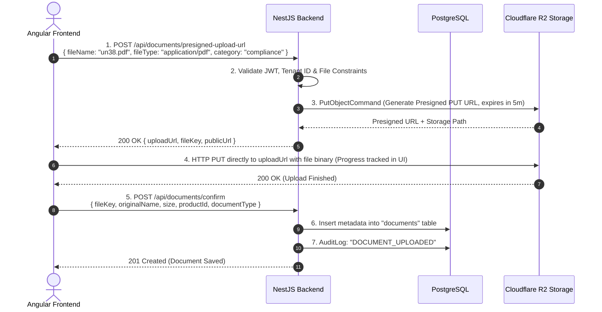

# ☁️ Cloudflare R2 Storage & Production Deployment Guide
## Digital Product Passport (DPP) Platform — Monkspaces

| Property | Specification |
| :--- | :--- |
| **Document Title** | Cloudflare R2 Storage, DMS Architecture & Production Deployment Blueprint |
| **System Name** | Monkspaces DPP Platform |
| **Storage Engine** | Cloudflare R2 (S3-Compatible Object Storage) + Cloudflare CDN |
| **Security Standard** | AES-256 Encryption at Rest, Time-Limited Presigned URLs (15 mins), RBAC Tiered Access |
| **Target Deployments** | Frontend (Cloudflare Pages / Vercel), Backend (Docker on Railway / AWS ECS), DB (PostgreSQL 17 Managed) |
| **Document Version** | v1.0 |

---

## 1. Executive Summary & Why Cloudflare R2 for DPP?

Under EU regulations (**ESPR 2024/1781** and **EU Battery Regulation 2023/1542**), millions of physical products (batteries, textiles, electronics) carry a QR code linked to a Digital Product Passport. 

Every time a consumer, customs authority, or recycler scans a QR code:
1. The web application resolves the GS1 Digital Link.
2. Product cover images, technical teardown diagrams, and certificates are downloaded.

### The Problem with Traditional AWS S3:
AWS charges **~$0.09 per GB of data transferred out (Egress Fee)**. If 100,000 users view high-resolution battery tear-down diagrams or 15MB compliance PDFs, bandwidth costs skyrocket.

### Why Cloudflare R2 Wins:
1. **$0 Egress (Zero Bandwidth Fees)**: Unlimited downloads without paying per-GB egress penalties.
2. **10 GB/Month Always Free Storage**: Perfect for MVP and initial enterprise pilot runs.
3. **100% S3 API Compatible**: Uses standard AWS S3 SDK (`@aws-sdk/client-s3`). No vendor lock-in; code can switch back to AWS S3 or MinIO with only `.env` changes.
4. **Native Edge CDN Integration**: Cached at 300+ global edge data centers for sub-50ms image loads worldwide.
5. **EU Data Sovereignty**: Buckets can be geographically pinned to the EU jurisdiction to comply with GDPR and CIRPASS requirements.

---

## 2. Storage Partitioning Architecture

To support the DPP **3-Tier Privacy Shield** (Public vs Professional vs Authority), files are strictly segregated:

```
Bucket: dpp-platform-files (Cloudflare R2)
│
├── public/                               <-- Caching Enabled, Direct Public CDN Access
│   ├── products/{productId}/
│   │   ├── cover.webp                   (Main product image)
│   │   └── gallery/{uuid}.webp          (Additional photo angles)
│   └── company-logos/{orgId}.png        (Manufacturer brand assets)
│
└── secure/                               <-- Blocked from Direct Public Access
    ├── compliance/{orgId}/
    │   ├── certificates/
    │   │   ├── ce-conformity-{uuid}.pdf (EU Declaration of Conformity)
    │   │   ├── un38.3-test-{uuid}.pdf   (Lithium Battery Transport Test)
    │   │   └── reach-rohs-{uuid}.pdf    (Hazardous substances dossiers)
    │   └── teardown-manuals/            (Professional recycler repair guides)
```

### Access Matrix:

| Category | Typical Files | Access Mechanism | Cache Policy |
| :--- | :--- | :--- | :--- |
| **Public Assets** | Product cover, gallery, brand logos | Direct CDN URL: `https://cdn.dpp.monkspaces.com/public/...` | Edge Cached (30 days) |
| **Professional Tier** | Disassembly guides, repair manuals | Presigned GET URL (Requires `member`, `recycler`, or `admin` JWT) | No CDN Cache, 30-min URL expiry |
| **Authority Tier** | CE conformity, UN 38.3 test lab reports | Presigned GET URL (Requires `compliance`, `auditor`, or `org_admin` JWT) | No CDN Cache, 15-min URL expiry + Audit Logged |

---

## 3. Upload Flow: Presigned URLs (Best Practice)

Rather than proxying large 20MB+ PDF documents through the NestJS Node.js process (which causes high RAM usage and CPU spikes), the system uses **Direct Client-to-R2 Presigned Uploads**:



---

## 4. Step-by-Step Cloudflare R2 Setup Guide

### Step 4.1: Create R2 Bucket in Cloudflare Dashboard
1. Log in to [Cloudflare Dashboard](https://dash.cloudflare.com/).
2. In the left sidebar, click **R2**.
3. Click **Create bucket**.
   - Bucket name: `dpp-platform-files`
   - Location: Choose **Europe (EU)** (Essential for EU DPP & ESPR compliance).
4. Click **Create Bucket**.

### Step 4.2: Generate S3-Compatible API Credentials
1. In Cloudflare R2, navigate to **Manage R2 API Tokens** (right sidebar).
2. Click **Create API Token**.
   - Token name: `monkspaces-dpp-backend`
   - Permissions: **Object Read & Write**
   - Apply to specific bucket: `dpp-platform-files`
   - TTL: Leave forever or set 1-year rotation.
3. Click **Create API Token**.
4. Copy the credentials (they are shown only once!):
   - **Access Key ID**
   - **Secret Access Key**
   - **Jurisdiction-Specific Endpoint**: (e.g. `https://<ACCOUNT_ID>.r2.cloudflarestorage.com`)

### Step 4.3: Configure CORS (Cross-Origin Resource Sharing)
Taaki Angular Frontend browser se directly file upload kar sake:
1. Open bucket `dpp-platform-files` -> **Settings** tab.
2. Scroll to **CORS Policy** and click **Add CORS Rule**:
   ```json
   [
     {
       "AllowedOrigins": [
         "http://localhost:4200",
         "https://dpp.monkspaces.com",
         "https://*.vercel.app"
       ],
       "AllowedMethods": ["GET", "PUT", "POST", "HEAD"],
       "AllowedHeaders": ["*"],
       "ExposeHeaders": ["ETag"],
       "MaxAgeSeconds": 3600
     }
   ]
   ```

### Step 4.4: Connect Custom Domain for Public Assets (CDN)
1. In bucket **Settings**, scroll to **Public Access** -> **Custom Domains**.
2. Click **Connect Domain**: Enter `cdn.dpp.monkspaces.com` (or your subdomain).
3. Cloudflare automatically issues an SSL certificate and enables edge caching for files in `public/*`.

---

## 5. Backend Configuration (.env)

Add the following keys to `backend/.env`:

```env
# ===========================================
# Cloudflare R2 / S3 Object Storage
# ===========================================
S3_ENDPOINT=https://<ACCOUNT_ID>.r2.cloudflarestorage.com
S3_BUCKET=dpp-platform-files
S3_REGION=auto
S3_ACCESS_KEY=your-r2-access-key-id
S3_SECRET_KEY=your-r2-secret-access-key
S3_PUBLIC_BASE_URL=https://cdn.dpp.monkspaces.com
```

---

## 6. Frontend Reusable File Uploader Component Design

The platform uses a dedicated, multi-mode Angular component: `<app-file-upload>`.

### Capabilities:
1. **Mode 1: `image` (Product cover, gallery, brand logo)**:
   - Live thumbnail preview.
   - Drag-and-drop or single click.
   - Format validation (`image/jpeg, image/png, image/webp`).
   - Size limit (e.g. max 5 MB).
   - Instant replace & delete actions.
2. **Mode 2: `certificate` / `document` (Compliance PDFs, EU declarations)**:
   - PDF badge and icon preview.
   - Multi-file or single-file support.
   - Shows file name, human-readable size, upload progress percentage.
   - Document type selector (e.g. *EU Conformity, Battery Test Report, REACH Dossier, Safety Manual*).
   - Expiration date tracking for regulatory validity.

---

## 7. Production Deployment Blueprint

### Infrastructure Topology:

```
[ Internet Traffic / QR Code Scans ]
                 │
                 ▼
     [ Cloudflare DNS + WAF + SSL ]
        │                       │
        │ /*                    │ /api/*
        ▼                       ▼
[ Frontend Host ]        [ Backend Host ]
Cloudflare Pages /       Railway.app / AWS ECS Fargate
Vercel (Angular 17)      (NestJS Container on Port 3000)
                                │
                 ┌──────────────┴──────────────┐
                 ▼                             ▼
       [ Managed PostgreSQL 17 ]       [ Cloudflare R2 Bucket ]
       Neon.tech / AWS RDS             (Images + Compliance Documents)
```

### Production Checklist:

1. **Database (PostgreSQL 17)**:
   - Use managed PostgreSQL with automatic daily backups and Point-In-Time Recovery (PITR).
   - Run migrations via automated CI/CD pipeline:
     ```bash
     npm run migration:run
     ```
2. **Backend (NestJS API)**:
   - Build production bundle: `npm run build`.
   - Run with PM2 or multi-stage Docker container: `CMD ["node", "dist/main"]`.
   - Set `NODE_ENV=production` and ensure JWT secrets are cryptographically random strings (min 64 chars).
3. **Frontend (Angular 17)**:
   - Build production static bundle: `ng build --configuration production`.
   - Ensure SPA rewrites are enabled (`/* -> /index.html`).
4. **Security & GDPR**:
   - Private bucket direct public listing is turned **OFF**.
   - Presigned download links have short lifespans (15 mins max).
   - Audit logs log every certificate view/download for compliance traceability.
