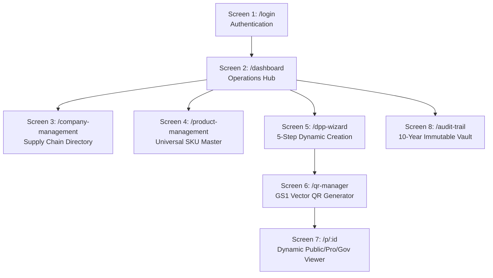
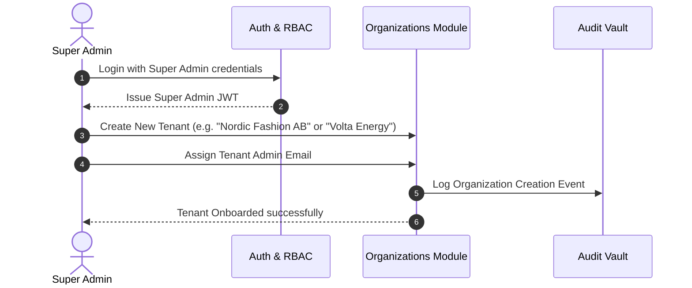
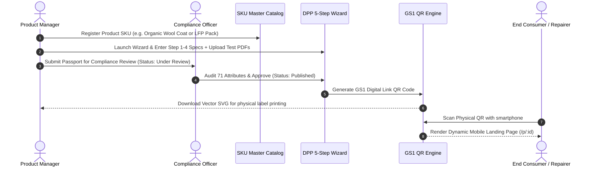
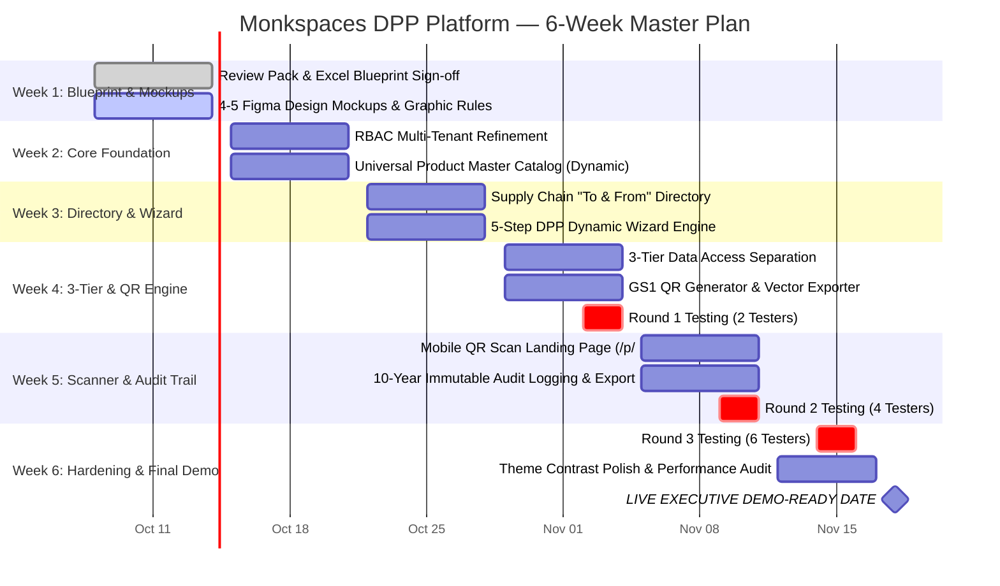
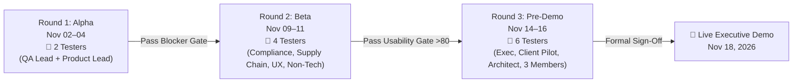

# 📋 Monkspaces DPP Platform — Executive Review Pack & Master Blueprint
## Deliverables for Tuesday Meeting Review (Mili Jain, Rakshambika Ramkumar, Raman Thakur)

> **Document Status**: Complete & Ready for Presentation  
> **Associated Excel File**: [`Monkspaces_DPP_Master_Specification_and_Plan.xlsx`](file:///f:/monk-dpp/Monkspaces_DPP_Master_Specification_and_Plan.xlsx)  
> **Target Demo-Ready Date**: **November 18, 2026 (End of Week 6)** — Fully Justified  
> **Scope**: Multi-Industry Universal DPP SaaS (Textiles, Batteries, Electronics, Construction, Industrial)

---

## 📑 Index of Deliverables

1. [Deliverable 1: User Roles & Permissions Matrix (Excel Format)](#1-user-roles--permissions-matrix)
2. [Deliverable 2: Screen-by-Screen & Button-by-Button Blueprint](#2-screen-by-screen--button-by-button-blueprint)
3. [Deliverable 3: End-to-End User Journeys & Flowcharts](#3-end-to-end-user-journeys--flowcharts)
4. [Deliverable 4: Prioritized Feature List (MoSCoW Framework)](#4-prioritized-feature-list-moscow)
5. [Deliverable 5: Six-Week Project Plan & Timeline (Microsoft Planner / Gantt)](#5-six-week-project-plan--timeline)
6. [Deliverable 6: Staggered Unbiased Testing Strategy (2 ➔ 4 ➔ 6 Testers)](#6-staggered-unbiased-testing-strategy)
7. [Deliverable 7: UI/UX Standards & Graphic Language Rules](#7-uiux-standards--graphic-language-rules)

---

## 1. User Roles & Permissions Matrix

*Note: Fully interactive version available in Tab 1 of [`Monkspaces_DPP_Master_Specification_and_Plan.xlsx`](file:///f:/monk-dpp/Monkspaces_DPP_Master_Specification_and_Plan.xlsx)*

| Module / Feature Area | Specific Action / Capability | Super Admin | Org Admin | Member / Product Mgr | Compliance Officer | External Supplier | Public / Consumer |
| :--- | :--- | :---: | :---: | :---: | :---: | :---: | :---: |
| **Auth & Profile** | Login / Logout / Password Reset | ✅ Yes | ✅ Yes | ✅ Yes | ✅ Yes | ✅ Magic Link | ❌ No Login |
| **Tenant Governance** | Create / Manage New Organizations | ✅ Yes | ❌ No | ❌ No | ❌ No | ❌ No | ❌ No |
| **Company Settings** | Update Branding, Logo, EORI / VAT | ✅ Yes | ✅ Own Org | ❌ View Only | ❌ View Only | ❌ No | ❌ No |
| **Team Management** | Invite Members & Assign Roles | ✅ Cross-Org | ✅ Own Org | ❌ No | ❌ No | ❌ No | ❌ No |
| **Supply Chain** | Register "From" Suppliers & "To" Clients | ✅ Yes | ✅ Yes | ✅ Yes | ❌ View Only | ❌ No | ❌ No |
| **Supply Chain** | Submit Tier-2 Material Declarations | ❌ No | ❌ No | ❌ No | ❌ No | ✅ Own Parts | ❌ No |
| **Product Master** | Create / Edit SKU Models & Photos | ✅ Yes | ✅ Yes | ✅ Yes | ❌ View Only | ❌ No | ❌ No |
| **Product Master** | Bulk CSV / Excel 500+ SKU Upload | ✅ Yes | ✅ Yes | ✅ Yes | ❌ No | ❌ No | ❌ No |
| **DPP Engine** | Create / Fill 5-Step Passport Wizard | ✅ Yes | ✅ Yes | ✅ Yes | ✅ Yes | ❌ No | ❌ No |
| **DPP Engine** | Formally Approve & Publish Passport | ✅ Yes | ✅ Yes | ❌ Request Only | ✅ Yes | ❌ No | ❌ No |
| **QR Code Engine** | Generate GS1 Digital Link & Vector QR | ✅ Yes | ✅ Yes | ✅ Yes | ✅ Yes | ❌ No | ❌ Scan Only |
| **QR Scan Viewer** | Public Sustainability & Care View | ✅ Yes | ✅ Yes | ✅ Yes | ✅ Yes | ✅ Yes | ✅ Yes (Open) |
| **QR Scan Viewer** | Professional Disassembly / Repair View | ✅ Yes | ✅ Yes | ✅ Yes | ✅ Yes | ❌ Restricted | ❌ No |
| **QR Scan Viewer** | Authority eIDAS Conformity View | ✅ Yes | ✅ Yes | ❌ Restricted | ✅ Yes | ❌ No | ❌ No |
| **Audit & Export** | 10-Year Immutable Changelog & JSON-LD | ✅ Yes | ✅ Yes | ❌ Recent Only | ✅ Full History | ❌ No | ❌ No |

---

## 2. Screen-by-Screen & Button-by-Button Blueprint

Following the approved **GBP Tool Model**, every interactive component is strictly defined:

### 2.1 Screen-Level Breakdown Summary
*(Full 25+ element breakdown with feedback states is exported to Tab 2 of the Excel file)*

* **Screen 1: `/login` (Sign In)**:
  * `Email Input`: Reactive validation against RFC 5322 format.
  * `Password Input`: Masked text with show/hide eye toggle button.
  * `Sign In Button`: Primary brand green, triggers JWT dual-token flow with spinner.
  * `Forgot Password Link`: Slide-over email verification modal.

* **Screen 2: `/dashboard` (Operations Hub)**:
  * `Metric Badge 1 (Total Passports)`: Active vs Draft split with dynamic count.
  * `Metric Badge 2 (Compliance Score)`: Percentage gauge (Green >90%, Amber 70-90%).
  * `Metric Badge 3 (Active QR Scans)`: 30-day scan volume with upward trend line.
  * `Category Filter Bar`: Filter tabs (`All`, `Textiles 👗`, `Batteries 🔋`, `Electronics 📱`).
  * `+ Create Passport Button`: Primary CTA routing to `/dpp-wizard`.
  * `Recent Passports Table`: Shows SKU, Category, Status Badge, and inline action buttons (View, Edit, QR).

* **Screen 3: `/company-management` (Supply Chain Directory)**:
  * `Provenance Filter Tabs`: `All Partners`, `Suppliers ("From")`, `OEM Clients ("To")`, `Recyclers`.
  * `Search Bar`: Instant search across Company Name, VAT/EORI, Country.
  * `+ Add Partner Button`: Triggers drawer with ISO/GOTS certificate uploader.

* **Screen 4: `/product-management` (Universal Master Catalog)**:
  * `Catalog Grid View`: Cards with real product images, Category badge, energy/fiber specs.
  * `+ New SKU Button`: Category selector dynamically adjusts attributes (Fiber composition vs Cell chemistry).
  * `Bulk Import CSV Button`: Drag-and-drop CSV validation modal.

* **Screen 5: `/dpp-wizard` (5-Step Dynamic Engine)**:
  * `Step 1 (Identity)`: SKU selector, GTIN & Serial Number input with GS1 checksum validator.
  * `Step 2 (Materials & Carbon)`: Dynamic key-value composition table, carbon footprint ($kg\ CO_2e$).
  * `Step 3 (Performance & Durability)`: Repairability index slider (1-10) or lifetime cycles.
  * `Step 4 (Circularity & EoL)`: PDF manual uploader (Care instructions / Disassembly guide).
  * `Step 5 (3-Tier Review & Publish)`: Public vs Pro vs Authority toggles + "Publish" CTA.

* **Screen 6: `/p/:id` (Mobile-First Dynamic QR Viewer)**:
  * `Public Tab`: Fast load (<150ms), product story, carbon rating, recycling drop-off map.
  * `Professional Tab`: Requires technician PIN/login, shows repair schematics.
  * `Authority Tab`: eIDAS-authenticated conformity declarations and REACH/RoHS lab test certs.

---

## 3. End-to-End User Journeys & Flowcharts

### 3.1 Super Admin Journey (Multi-Tenant & System Governance)

### 3.2 Product Manager & Compliance Journey (DPP Creation to QR Publication)

---

## 4. Prioritized Feature List (MoSCoW)

* **MUST HAVE (Phase 1 — Core MVP)**:
  1. Multi-Tenant JWT Authentication & RBAC.
  2. Universal Master Product Catalog with Dynamic Schemas (Textiles, Batteries, Electronics).
  3. Supply Chain "To & From" Directory with provenance tags.
  4. 5-Step Guided DPP Creation Wizard.
  5. 3-Tier Data Separation Engine (Public / Professional / Authority).
  6. GS1 Digital Link QR Generator & Vector SVG/PNG Export.
  7. Mobile-Optimized Dynamic QR Landing Page.
  8. 10-Year Immutable Audit Trail Logging.

* **SHOULD HAVE (Phase 1 Polish / Phase 2)**:
  1. JSON-LD Standard Interoperability Export & Official PDF Certificate.
  2. Bulk CSV/Excel SKU Importer (500+ items).
  3. Supplier Magic Link Self-Service Portal.

* **COULD HAVE (Phase 2 / 3)**:
  1. EU Central DPP Registry Direct API Connector (Brussels sync).
  2. AI-powered PDF Datasheet / Lab Test Extractor.

* **WON'T HAVE (For Initial MVP Demo)**:
  1. Blockchain / DLT Notarization (Deferred until EU mandates on DLT are finalized).

---

## 5. Six-Week Project Plan & Timeline

### 5.1 Justification for Demo-Ready Date (November 18, 2026)
1. **Quality Gate Compliance**: Provides 2 weeks for planning & UI validation, 3 weeks for incremental build & 3-tier security, and 1 full week for 3 staggered testing rounds.
2. **Zero Rework**: By locking blueprints and Figma mockups in Week 1, frontend and backend will build strictly to spec.
3. **Unbiased Validation**: Leaves adequate time for Round 1 (2 testers), Round 2 (4 testers), and Round 3 (6 testers) to sign off before executive presentation.

---

## 6. Staggered Unbiased Testing Strategy

Per **Mili Jain's directive**, testing will follow an isolated, progressive rollout where only designated testers see the tool on scheduled testing days:

| Testing Phase | Scheduled Dates | Cohort Size | Designated Roles | Test Objectives | Unbiased Protocol |
| :--- | :--- | :---: | :--- | :--- | :--- |
| **Round 1 (Alpha)** | Nov 02 – Nov 04, 2026 | **2 People** | Tester 1: QA Lead Tester 2: Product Lead | Core CRUD, SKU creation, 5-step wizard completion, QR rendering. | Blind testing with task prompts only. No prior walk-through. |
| **Round 2 (Beta)** | Nov 09 – Nov 11, 2026 | **4 People** | Tester 3: Compliance Lead Tester 4: Supply Chain Lead Tester 5: UI/UX Expert Tester 6: Non-tech User | End-to-end multi-industry flow (Textiles & Batteries), 3-tier privacy leakage check, mobile scan experience. | Screen recordings without verbal assistance. Log UX friction points objectively. |
| **Round 3 (Pre-Demo)** | Nov 14 – Nov 16, 2026 | **6 People** | Tester 7: Executive Stakeholder Tester 8: External Pilot Client Tester 9: Senior Architect Tester 10–12: Cross-functional | Full platform stress test, PDF/JSON-LD export validation, light/dark theme contrast verification. | Final acceptance gate sign-off for live demonstration. |

---

## 7. UI/UX Standards & Graphic Language Rules

### 7.1 Consistency & Brand Alignment
* **Corporate Visual Standard**: Aligned seamlessly with the official Monkspaces web identity.
* **Typography**:
  * *Primary UI*: **Inter** / **Plus Jakarta Sans** / **Segoe UI** (weights: 400, 500, 600, 700).
  * *Data & Technical Codes*: **JetBrains Mono** / **Roboto Mono** (used strictly for GTIN, Serial Numbers, and Hashes).
* **Color Palette (WCAG AAA Compliant)**:
  * *Primary Brand*: Emerald & Deep Teal (`#0F766E`, `#059669`) — representing circularity and trust.
  * *Neutrals*: Slate scale (`#F8FAFC` background to `#0F172A` text). Strictly avoid pure harsh `#000000`.
  * *Status Badges*: Published (`#10B981`), Under Review (`#F59E0B`), Draft (`#64748B`), Alert (`#EF4444`).
* **Iconography System**:
  * **Strictly no cartoonish icons**.
  * Use **Lucide Icons** / **Heroicons** with a consistent `2px` stroke outline.
* **Theme Standards (Light vs. Dark Mode)**:
  * **Default**: **Clean Light Mode** (prioritizing readability and corporate presentation).
  * **Toggle Option**: **Eco Dark Mode** (offered as an energy-saving circular design feature).

### 7.2 The 4–5 Mockup Layout Options for Tuesday Review
To provide stakeholders with clear visual choices:
1. **Option A: Clean Executive Hub** (Focused on high-level compliance KPI metrics and clean white cards).
2. **Option B: Modern Product Card-Grid** (Visual-first with rich product imagery and dynamic badges).
3. **Option C: Compact Dense Data Table** (Enterprise-grade, optimized for compliance teams managing 500+ SKUs).
4. **Option D: Interactive Circular Flow** (Visual supply chain provenance map showing "From" ➔ "Product" ➔ "To" ➔ "Recycler").

---

## 🎯 Summary for Rakshambika & Raman (Tuesday Presentation Checklist)

1. **Excel Sheet Ready**: Share [`Monkspaces_DPP_Master_Specification_and_Plan.xlsx`](file:///f:/monk-dpp/Monkspaces_DPP_Master_Specification_and_Plan.xlsx) which contains all 6 tabs with structured tables and color-coded status rules.
2. **Document Alignment**: Present this complete document covering User Roles, 6-Week Gantt, Staggered Testing (2 ➔ 4 ➔ 6), and UI/UX rules.
3. **Justified Timeline**: State clearly that development will resume in full speed immediately following mockup sign-off, leading to a rock-solid **Demo-Ready date of November 18, 2026**.
