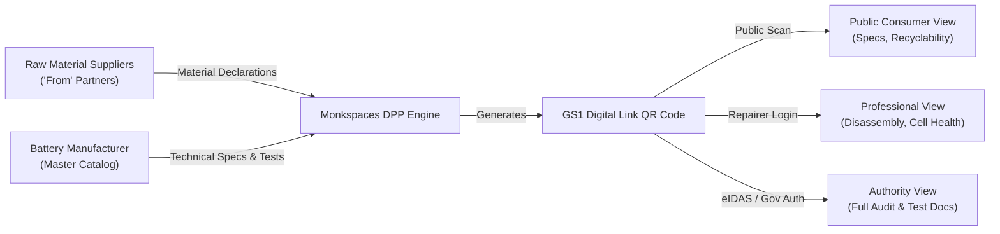
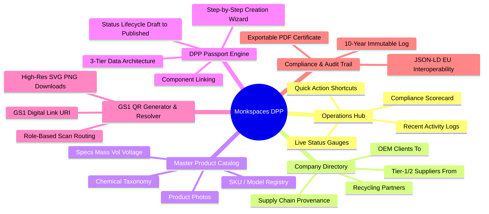
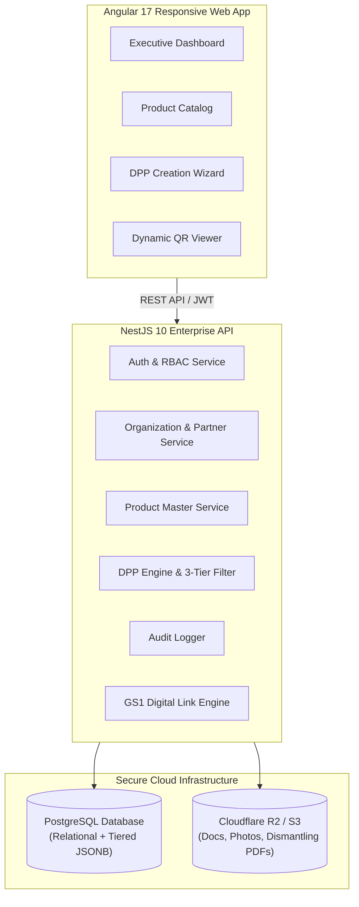
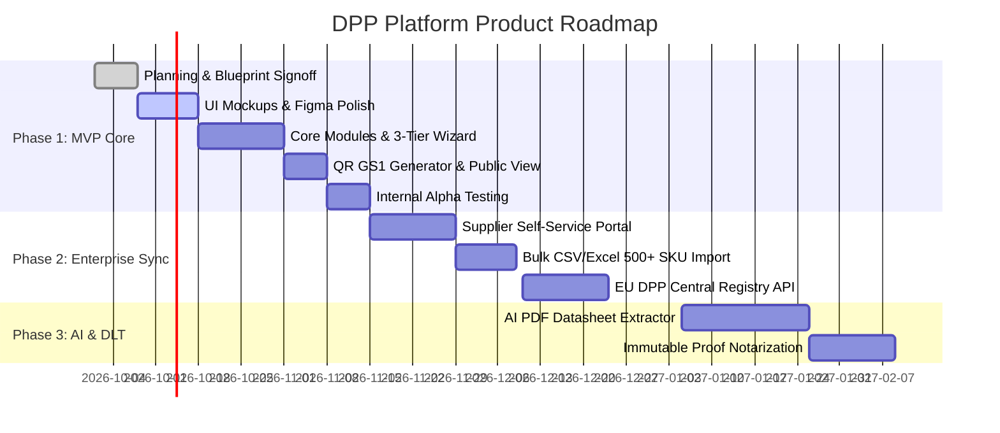

# 🇪🇺 Monkspaces Digital Product Passport (DPP) Platform
## Master Product Blueprint & Planning Specification (v1.0)

> **Document Status**: Ready for Stakeholder & Design Review  
> **Author**: Product & Architecture Team  
> **Target Regulations**: EU Battery Regulation (2023/1542), Ecodesign for Sustainable Products (ESPR 2024/1781), GS1 Digital Link Standard  
> **Primary Use-Case**: Electric Vehicles (EV), Light Means of Transport (LMT), and Industrial Energy Storage Batteries (>2 kWh)

---

## 1. Executive Summary & Problem Context

### 1.1 Why are we building the DPP Platform?
Starting **February 18, 2027**, the European Union mandates that every industrial, EV, and light-transport battery placed on the EU market must have an active **Digital Product Passport (DPP)** accessible via a physical QR code. Products without compliant passports will face market ban, import seizures, and heavy penalties.

### 1.2 Market Problem
- **Legacy enterprise tools** (e.g., Kezzler, Circularise, Minespider) take 6–12 months to deploy and cost $150k+/year, locking out mid-market manufacturers.
- **Manual compliance** via spreadsheets and static PDFs is impossible due to the requirement of real-time dynamic data, 10-year immutable audit trails, and multi-tier access security.
- **Lack of standardization**: Manufacturers struggle to structure 71+ mandatory compliance fields (carbon footprint, supply chain provenance, recycled content, and disassembly manuals).

### 1.3 The Solution: Monkspaces DPP Platform
A lightweight, modern, multi-tenant B2B SaaS platform that allows manufacturers, suppliers, and OEMs to:
1. Manage master product catalogs and supply chain entities ("To & From" partners).
2. Generate compliant Digital Product Passports with 3-tier data security.
3. Automatically generate GS1-compliant QR codes linked to dynamic digital passports.
4. Provide instant public verification, professional repairer access, and government audit inspection.

---

## 2. User Personas & Target Audiences

| Persona | Role | Primary Goal in the System | Key Actions / Journey |
| :--- | :--- | :--- | :--- |
| **Org Admin / VP Compliance** | Executive / Legal Head | Track overall compliance score & multi-brand health | Dashboard overview, inviting team members, auditing regulatory readiness. |
| **Product / Quality Engineer** | Technical Manager | Create and publish passports for each battery SKU | Filling 71 data attributes in wizard, attaching lab test certificates, downloading QR. |
| **Supply Chain Partner ("From")** | Component / Cell Supplier | Declare raw materials & carbon emissions | Submitting bill of materials, cell composition, origin proof. |
| **Independent Repairer** | Certified EV Technician | Safely dismantle, repair, or repurpose battery | Scanning physical QR code, logging in, accessing safe dismantling manuals. |
| **Market Surveillance Authority** | EU Regulatory Inspector | Verify conformity and chemistry thresholds | Inspecting official lab certificates, toxic substance levels, CE marks. |
| **End Consumer / Recycler** | Buyer / Scrap Recycler | View sustainability rating & find drop-off center | Scanning QR on vehicle/battery, viewing carbon footprint and recycling centers. |

---

## 3. Core Functional Modules (The 6 Pillars)

---

## 4. Detailed UI Screen Blueprints & Mockup Specifications

### Screen 1: Executive Operations Hub (`/dashboard`)
* **Goal**: Provide instantaneous visibility into passport readiness, published assets, and compliance alerts.
* **Layout & Key Widgets**:
  1. **Top Metric Badges**:
     - *Total Passports*: Total count with active vs draft split.
     - *Compliance Health*: Global compliance index percentage (e.g. 96%).
     - *Active QR Scans*: Total scans recorded in the last 30 days.
     - *Linked Supply Chain Partners*: Active suppliers and client endpoints.
  2. **Passport Status Distribution**:
     - Visual breakdown cards: `Draft` (gray), `Under Review` (amber), `Published` (emerald), `Archived` (slate).
  3. **Recent Passports Table**:
     - Model Name, GTIN/Serial, Battery Chemistry (e.g. LiFePO4, NMC), Status, Last Updated, and Quick Action buttons (View, Edit, QR).
  4. **Quick Launch Actions**:
     - *"+ Create New Passport"*, *"Register Product SKU"*, *"Add Supply Chain Partner"*.

---

### Screen 2: Supply Chain & Company Directory (`/company-management`)
* **Goal**: Map provenance ("Where do parts come from?" and "Where does the battery go?").
* **Layout & Key Widgets**:
  1. **Partner Categorization Tabs**:
     - `All Partners`, `Suppliers ("From")`, `OEM / Brand Clients ("To")`, `Recyclers`.
  2. **Partner Card / Grid View**:
     - Company Name, Registration No / EORI, Country of Origin, Material Supplied, Verification Badge (Verified / Pending).
  3. **"Add Partner" Drawer**:
     - Company Legal Name, Point of Contact, Country, Supply Category, Due Diligence Documents.

---

### Screen 3: Master Product Catalog (`/product-management`)
* **Goal**: Centralized library of battery product models and SKUs before passport assignment.
* **Layout & Key Widgets**:
  1. **Product Gallery Grid**:
     - High-resolution product images, Model Name, SKU, Energy Capacity (kWh), Chemistry Badge, Linked Active Passports count.
  2. **Product Specification Drawer / Modal**:
     - General Info: Model No, Commercial Name, Brand.
     - Physical Characteristics: Dimensions (L x W x H mm), Mass (kg), Form Factor (Prismatic, Cylindrical, Pouch).
     - Electrical Performance: Nominal Voltage, Rated Capacity (Ah), Energy (kWh), Lifetime Cycles.

---

### Screen 4: DPP Creation Wizard (`/dpp-wizard`)
* **Goal**: Guided 5-step intuitive workflow to enter EU-compliant data without regulatory overwhelm.
* **Step Breakdown**:
  - **Step 1: General Product Identity**: Select SKU from catalog, assign unique Serial Number & GTIN, define manufacturing date and plant location.
  - **Step 2: Battery Chemistry & Carbon Footprint**: Active material selection (NMC 811, LFP), total carbon footprint ($kg\ CO_2e / kWh$), recycled cobalt/nickel/lithium percentages.
  - **Step 3: Performance & Durability**: Cycle life, rated capacity, internal resistance, round-trip energy efficiency (%).
  - **Step 4: Circularity & End-of-Life**: Safe dismantling manual PDF upload, toxic substance declarations, spare parts availability list.
  - **Step 5: Review & 3-Tier Access Configuration**: Preview what Public, Professional, and Authority users will see; submit for Publishing.

---

### Screen 5: Public & Role-Based Passport Scan View (`/p/:id` & `/scan`)
* **Goal**: Dynamic landing page loaded when physical QR code is scanned via smartphone or industrial scanner.
* **Layout & Dynamic Views**:
  - **Public Tab (Default - No login needed)**:
    - Clean mobile-first UI: Product photo, Carbon score badge, Battery chemistry overview, Recyclability & nearest drop-off instructions.
  - **Professional Tab (Requires Repairer Login)**:
    - Detailed cell voltage tolerances, thermal runaway prevention instructions, step-by-step disassembly guide with downloadable CAD/PDF.
  - **Authority Tab (Requires Verified Government Token)**:
    - Complete conformity declaration, accredited test laboratory reports, REACH/RoHS compliance certificates.

---

### Screen 6: QR Code Manager & GS1 Digital Link (`/qr-manager`)
* **Goal**: Generate and export production-ready vector QR codes.
* **Features**:
  - Encodes official GS1 Digital Link standard URI: `https://app.monkspaces.com/01/{GTIN}/21/{SERIAL}`.
  - Export in Vector SVG (for label printing) and high-res PNG (for digital packaging).
  - Custom branding options (embedded logo in QR center).

---

### Screen 7: Immutable Audit Trail & Interoperability (`/audit-trail` & `/export`)
* **Goal**: Meet EU 10-year data persistence and compliance inspection requirements.
* **Features**:
  - Chronological timeline log of every field change, user timestamp, and status transition.
  - 1-click **JSON-LD Export** adhering to W3C Verifiable Credentials & EU DPP schema.
  - Official PDF Passport Certificate download for offline customs clearance.

---

## 5. Technical Architecture & Data Model Blueprint

### 5.1 3-Tier Database Security Strategy
- **Public Data Table / JSONB**: Contains only open sustainability and safety data.
- **Protected Data Table / JSONB**: Stores proprietary dismantling manuals, repair schematics, and cell degradation curves (accessible only with `ROLE_PROFESSIONAL` or higher).
- **Confidential Data Table / JSONB**: Stores supplier trade secrets, chemical tolerances, and compliance audit certificates (accessible only with `ROLE_AUTHORITY` or `ROLE_ORG_ADMIN`).

---

## 6. Implementation Phasing & Delivery Roadmap

---

## 7. Next Steps for Stakeholders & UI/UX Designers

1. **Step 1: Stakeholder Sign-Off**: Present this Blueprint Document to leadership to confirm functional scope and regulatory alignment.
2. **Step 2: Figma / UI Mockups Creation**: Hand over Screen Specifications (Section 4) to UI/UX designer to produce high-fidelity mockups.
3. **Step 3: User Journey Validation**: Review interactive prototypes with compliance engineers and pilot customers.
4. **Step 4: Agile Sprint Execution**: Align the frontend (Angular) and backend (NestJS) development directly to the approved mockups.
